```R
# library(tidyverse)
library(ggplot2)
library(vegan)
library(phyloseq)
# library (ape)
library(RColorBrewer)
```

    Loading required package: permute
    Loading required package: lattice
    This is vegan 2.5-4


```R
otu <- as.matrix(read.table("ASVs_counts.tsv", header=T, row.names=1)) #tabla de OTUs sin singletons, formato tabular.  eliminados con: http://qiime.org/scripts/filter_otus_from_otu_table.html
OTU = otu_table(otu, taxa_are_rows=T)
head(OTU)
taximat = as.matrix(read.table("ASVs_taxonomy.tsv", header=T, row.names=1)) #revisar los encabezados
taxi=tax_table(taximat)
metro = phyloseq(OTU, taxi)
sample_names(metro)
data= read.table("THEmetadata.txt", header=T, row.names=1, sep="\t")#los metadatos deben de estar en el mismo orden en el que estan en la tabla de OTUs:  sample_data(camaron)
sampledata = sample_data(data.frame(id=data$id, sample_location=data$sample_location, sample_id=data$sample_id,line_number=data$line_number, sample_type=data$sample_type, date=data$date, time=data$time, temperature_C=data$temperature_C, Humidity=data$Humidity, length_underground=data$ length_underground, length_superficial=data$length_superficial, length_elevated=data$length_elevated, length_total=data$length_total, elevation=data$elevation, station=data$station_hubs, train_track=data$train_track, train_notes=data$train_notes, station_notes=data$station_notes, geographical_zone=data$geographical_zone, weather=data$weather, stations_number=data$stations_number, latitude=data$latitude, longitude=data$longitude, people_affluence=data$people_affluence, Observed=data$Observed, Chao1=data$Chao1, Shannon=data$Shannon, Simpson=data$Simpson, row.names=sample_names(metro)))
# tree <- read.newick("metro.tre")
# tree <- collapse.singles(tree)
metro = phyloseq (OTU, sampledata, taxi)

metro
```


<table>
<thead><tr><th></th><th scope=col>AM01</th><th scope=col>AM02</th><th scope=col>AM03</th><th scope=col>AM04</th><th scope=col>AM05</th><th scope=col>AM06</th><th scope=col>AM07</th><th scope=col>AM08</th><th scope=col>AM09</th><th scope=col>AM10</th><th scope=col>⋯</th><th scope=col>AM39</th><th scope=col>AM40</th><th scope=col>AM41</th><th scope=col>AM42</th><th scope=col>AM43</th><th scope=col>AM44</th><th scope=col>AM45</th><th scope=col>AM46</th><th scope=col>AM47</th><th scope=col>AM48</th></tr></thead>
<tbody>
	<tr><th scope=row>ASV_1</th><td>10459</td><td>8198 </td><td>6740 </td><td>5339 </td><td>114  </td><td>15981</td><td>9607 </td><td>4123 </td><td>5860 </td><td>4780 </td><td>⋯    </td><td>9224 </td><td>20148</td><td>15588</td><td>15573</td><td>7217 </td><td>43753</td><td>19733</td><td>13121</td><td>35807</td><td>19170</td></tr>
	<tr><th scope=row>ASV_2</th><td> 2232</td><td>6735 </td><td>3194 </td><td>2244 </td><td> 69  </td><td> 3268</td><td>3663 </td><td>1786 </td><td>2574 </td><td>3542 </td><td>⋯    </td><td>1476 </td><td> 3016</td><td> 3018</td><td> 1699</td><td> 764 </td><td> 1450</td><td> 3853</td><td> 2261</td><td> 1191</td><td> 2595</td></tr>
	<tr><th scope=row>ASV_3</th><td>  997</td><td>1372 </td><td>3194 </td><td>   0 </td><td>  0  </td><td>    0</td><td>   0 </td><td> 462 </td><td>   0 </td><td>   0 </td><td>⋯    </td><td> 487 </td><td>  389</td><td>  299</td><td> 3555</td><td>1510 </td><td>  477</td><td>    0</td><td> 3658</td><td>  502</td><td>    0</td></tr>
	<tr><th scope=row>ASV_4</th><td>  705</td><td>1456 </td><td> 454 </td><td>1279 </td><td>115  </td><td>  485</td><td>5619 </td><td> 367 </td><td>2370 </td><td> 786 </td><td>⋯    </td><td>1682 </td><td> 3666</td><td> 1036</td><td> 2506</td><td> 474 </td><td> 6183</td><td> 5043</td><td>  737</td><td> 2413</td><td> 2674</td></tr>
	<tr><th scope=row>ASV_5</th><td> 1752</td><td>1938 </td><td>1800 </td><td>1050 </td><td> 31  </td><td> 7149</td><td>1617 </td><td>1268 </td><td>1337 </td><td>2806 </td><td>⋯    </td><td>2826 </td><td>  639</td><td> 1106</td><td> 1322</td><td> 685 </td><td> 1740</td><td> 2532</td><td> 2583</td><td>  690</td><td> 4561</td></tr>
	<tr><th scope=row>ASV_6</th><td> 1053</td><td>2408 </td><td> 672 </td><td>3084 </td><td> 72  </td><td> 1809</td><td>3995 </td><td> 675 </td><td>7260 </td><td>1097 </td><td>⋯    </td><td>3187 </td><td> 1961</td><td> 1231</td><td>  791</td><td> 430 </td><td>  983</td><td> 5016</td><td> 1659</td><td>  305</td><td> 1469</td></tr>
</tbody>
</table>


<ol class=list-inline>
	<li>'AM01'</li>
	<li>'AM02'</li>
	<li>'AM03'</li>
	<li>'AM04'</li>
	<li>'AM05'</li>
	<li>'AM06'</li>
	<li>'AM07'</li>
	<li>'AM08'</li>
	<li>'AM09'</li>
	<li>'AM10'</li>
	<li>'AM11'</li>
	<li>'AM12'</li>
	<li>'AM13'</li>
	<li>'AM14'</li>
	<li>'AM15'</li>
	<li>'AM16'</li>
	<li>'AM17'</li>
	<li>'AM18'</li>
	<li>'AM19'</li>
	<li>'AM20'</li>
	<li>'AM21'</li>
	<li>'AM22'</li>
	<li>'AM23'</li>
	<li>'AM24'</li>
	<li>'AM26'</li>
	<li>'AM27'</li>
	<li>'AM28'</li>
	<li>'AM29'</li>
	<li>'AM30'</li>
	<li>'AM31'</li>
	<li>'AM32'</li>
	<li>'AM33'</li>
	<li>'AM34'</li>
	<li>'AM35'</li>
	<li>'AM36'</li>
	<li>'AM37'</li>
	<li>'AM38'</li>
	<li>'AM39'</li>
	<li>'AM40'</li>
	<li>'AM41'</li>
	<li>'AM42'</li>
	<li>'AM43'</li>
	<li>'AM44'</li>
	<li>'AM45'</li>
	<li>'AM46'</li>
	<li>'AM47'</li>
	<li>'AM48'</li>
</ol>


    phyloseq-class experiment-level object
    otu_table()   OTU Table:         [ 22673 taxa and 47 samples ]
    sample_data() Sample Data:       [ 47 samples by 28 sample variables ]
    tax_table()   Taxonomy Table:    [ 22673 taxa by 6 taxonomic ranks ]


```R
p <- plot_richness(metro, x="sample_type", color="line_number", measures=c("Observed", "Chao1", "Shannon", "Simpson")) + geom_boxplot()+theme_light() + theme(axis.text.x=element_text(angle=90, hjust=1))
#p$data
a <-p$data

p

p <- plot_richness(metro, x="sample_type", measures=c("Observed", "Chao1", "Shannon", "Simpson")) + geom_boxplot()+theme_light() + theme(axis.text.x=element_text(angle=90, hjust=1))
#p$data
p
ggsave("histogramaASV_Alfa_diversidad.pdf")

p <- plot_richness(metro, x="line_number", color="stations_number", measures=c("Observed", "Chao1", "Shannon", "Simpson")) + geom_boxplot()+theme_light() + theme(axis.text.x=element_text(angle=90, hjust=1))
#p$data
p

p <- plot_richness(metro, x="station",color="people_affluence", measures=c("Observed", "Chao1", "Shannon", "Simpson")) + geom_boxplot()+theme_light() + theme(axis.text.x=element_text(angle=90, hjust=1))
#p$data
p

p <- plot_richness(metro, x="train_track",color="people_affluence", measures=c("Observed", "Chao1", "Shannon", "Simpson")) + geom_boxplot()+theme_light() + theme(axis.text.x=element_text(angle=90, hjust=1))
#p$data
p


p <- plot_richness(metro, x="train_notes",color="people_affluence", measures=c("Observed", "Chao1", "Shannon", "Simpson")) + geom_boxplot()+theme_light() + theme(axis.text.x=element_text(angle=90, hjust=1))
#p$data
p

p <- plot_richness(metro, x="station_notes",color="people_affluence", measures=c("Observed", "Chao1", "Shannon", "Simpson")) + geom_boxplot()+theme_light() + theme(axis.text.x=element_text(angle=90, hjust=1))
#p$data
# p

p <- plot_richness(metro, x="sample_type",color="Shannon.1", measures= "Shannon") + geom_boxplot()+theme_light() + theme(axis.text.x=element_text(angle=90, hjust=1))
a<- p$data
summary
p
write.csv(a,"shannon.estacion.csv",sep="\t")

```


                          id                  sample_location   sample_id  
     Barranca_del_muerto_7 :  4   Train               :92     AM01   :  4  
     Buenavista_B          :  4   Barranca_del_muerto : 4     AM02   :  4  
     Chilpancingo_9        :  4   Buenavista          : 4     AM03   :  4  
     Ciudad_Azteca_B       :  4   Chilpancingo        : 4     AM04   :  4  
     Constitucion_de_1917_8:  4   Ciudad_Azteca       : 4     AM05   :  4  
     Cuatro_caminos_2      :  4   Constitucion_de_1917: 4     AM06   :  4  
     (Other)               :164   (Other)             :76     (Other):164  
      line_number     sample_type      date             time     temperature_C  
     2      :24   Pasamanos :92   2/5/16 :36   11:25:00 AM:  8   Min.   :25.90  
     11(B)  :20   Torniquete:96   3/5/16 :28   11:42:00 AM:  8   1st Qu.:29.10  
     3      :20                   4/16/27:36   1:20:00 PM :  8   Median :30.40  
     1      :16                   4/16/28:24   12:05:00 PM:  8   Mean   :30.15  
     10(A)  :16                   4/16/29:40   12:40:00 PM:  8   3rd Qu.:31.30  
     7      :16                   4/5/16 :24   12:50:00 PM:  8   Max.   :33.30  
     (Other):76                                (Other)    :140                  
        Humidity     length_underground length_superficial length_elevated 
     Min.   :25.00   Min.   : 0.00      Min.   : 0.000     Min.   : 0.000  
     1st Qu.:27.00   1st Qu.: 5.38      1st Qu.: 0.000     1st Qu.: 0.000  
     Median :30.00   Median :11.86      Median : 4.449     Median : 0.000  
     Mean   :30.38   Mean   :11.05      Mean   : 5.485     Mean   : 2.001  
     3rd Qu.:32.00   3rd Qu.:16.79      3rd Qu.:10.724     3rd Qu.: 4.185  
     Max.   :41.00   Max.   :18.14      Max.   :15.151     Max.   :11.533  
                                                                           
      length_total     elevation                        station      train_track 
     Min.   :11.00   Min.   :2231   Correspondecia          :12   Ferreo   : 28  
     1st Qu.:16.00   1st Qu.:2237   Paso                    :24   Neumatico:160  
     Median :18.00   Median :2242   Terminal                :44                  
     Mean   :18.83   Mean   :2250   Terminal_correspondencia:16                  
     3rd Qu.:22.00   3rd Qu.:2256   Train                   :92                  
     Max.   :25.00   Max.   :2303                                                
                     NA's   :92                                                  
            train_notes            station_notes geographical_zone weather  
     Independiente:136   Cajon_subterraneo:44    Centro  :20       B1  :16  
     Oruga        : 52   Elevada          :36    Norte   :28       C1  :64  
                         Superficial      :12    Oriente :20       C2  :16  
                         Tunel            : 4    Poniente:12       NA's:92  
                         NA's             :92    Sur     :16                
                                                 NA's    :92                
                                                                            
     stations_number    latitude       longitude      people_affluence  
     Min.   :10.00   Min.   :19.29   Min.   :-99.22   Min.   :  499350  
     1st Qu.:12.00   1st Qu.:19.39   1st Qu.:-99.17   1st Qu.: 4190568  
     Median :19.00   Median :19.43   Median :-99.14   Median : 9523016  
     Mean   :17.15   Mean   :19.43   Mean   :-99.13   Mean   :17859153  
     3rd Qu.:21.00   3rd Qu.:19.49   3rd Qu.:-99.10   3rd Qu.:24196452  
     Max.   :24.00   Max.   :19.53   Max.   :-98.96   Max.   :66232325  
                     NA's   :92      NA's   :92                         
       Observed.1       Chao1.1          Shannon.1       Simpson.1     
     Min.   :  428   Min.   :  840.2   Min.   :4.102   Min.   :0.8984  
     1st Qu.: 7655   1st Qu.:12618.1   1st Qu.:6.004   1st Qu.:0.9802  
     Median :10129   Median :15375.8   Median :6.410   Median :0.9872  
     Mean   : 9904   Mean   :15141.1   Mean   :6.380   Mean   :0.9827  
     3rd Qu.:12677   3rd Qu.:18521.1   3rd Qu.:6.863   3rd Qu.:0.9916  
     Max.   :16179   Max.   :23052.1   Max.   :7.384   Max.   :0.9960  
                                                                       
       samples              variable      value                 se        
     Length:188         Observed:47   Min.   :   0.7292   Min.   : 0.000  
     Class :character   Chao1   :47   1st Qu.:   2.5084   1st Qu.: 5.580  
     Mode  :character   Shannon :47   Median :  37.0522   Median : 7.086  
                        Simpson :47   Mean   : 561.0525   Mean   : 6.989  
                                      3rd Qu.:1087.0000   3rd Qu.: 8.543  
                                      Max.   :2009.0065   Max.   :17.183  
                                                          NA's   :141     


    Warning message:
    “Removed 141 rows containing missing values (geom_errorbar).”Warning message:
    “Removed 141 rows containing missing values (geom_errorbar).”


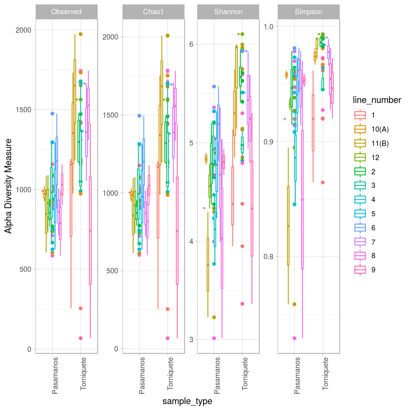


    Saving 6.67 x 6.67 in image
    Warning message:
    “Removed 141 rows containing missing values (geom_errorbar).”Warning message:
    “Removed 141 rows containing missing values (geom_errorbar).”


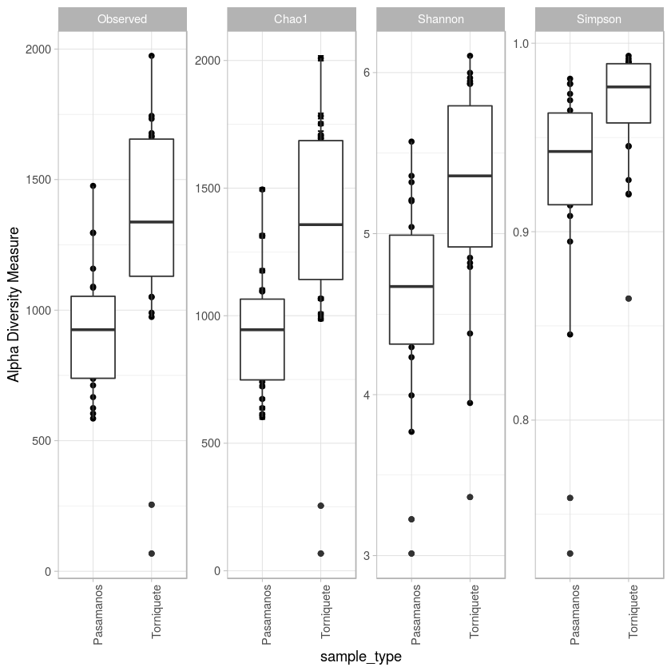


    Warning message:
    “Removed 141 rows containing missing values (geom_errorbar).”


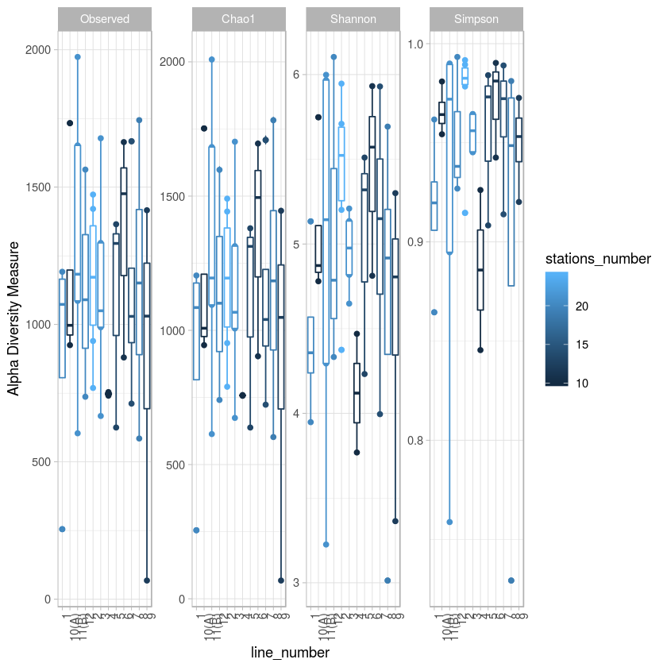


    Warning message:
    “Removed 141 rows containing missing values (geom_errorbar).”


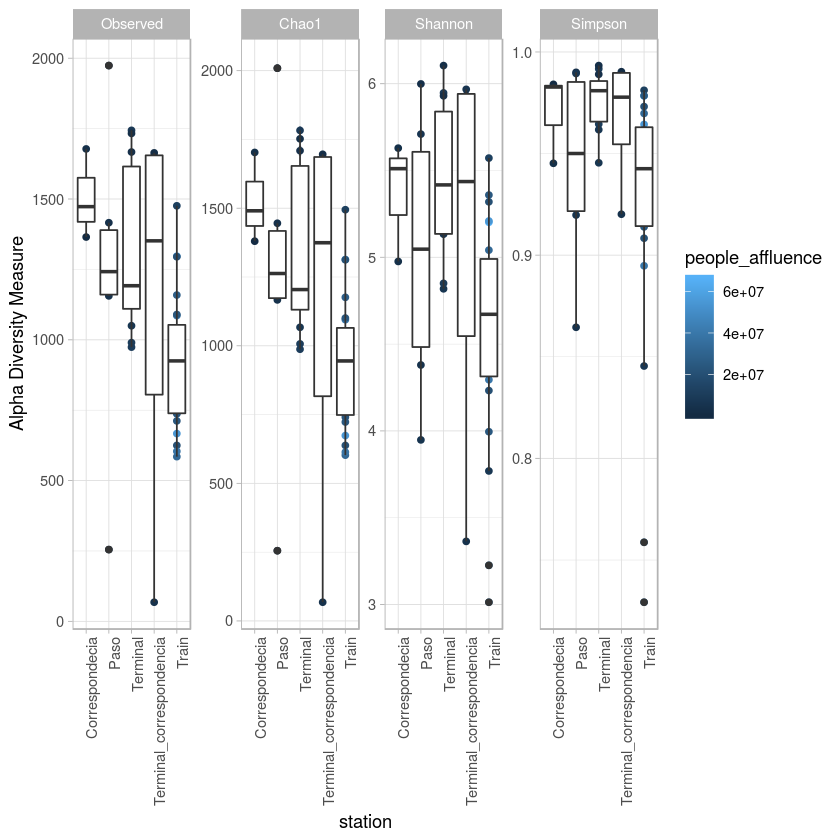


    Warning message:
    “Removed 141 rows containing missing values (geom_errorbar).”


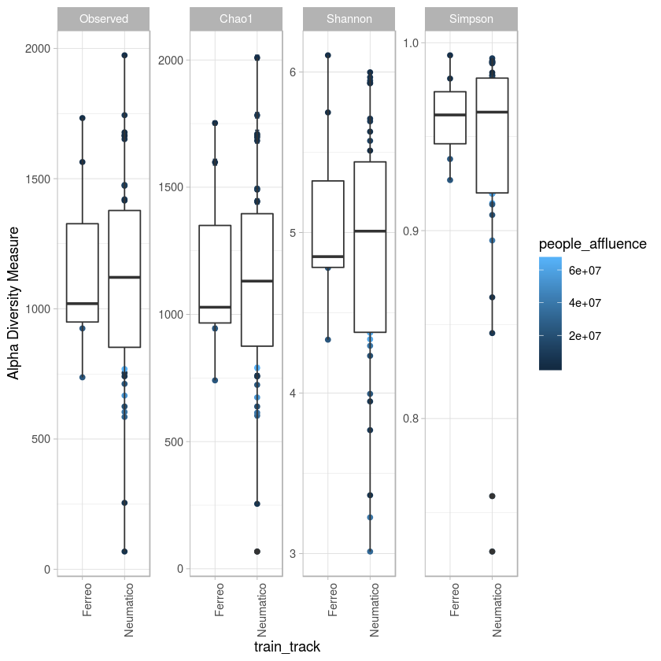


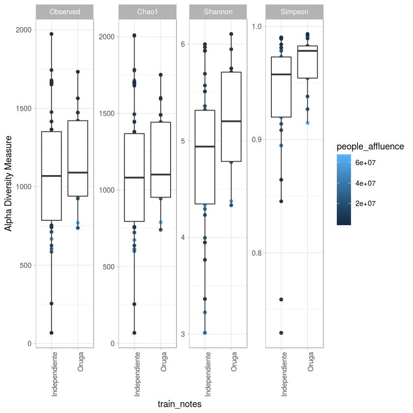


    Warning message in write.csv(a, "shannon.estacion.csv", sep = "\t"):
    “attempt to set 'sep' ignored”


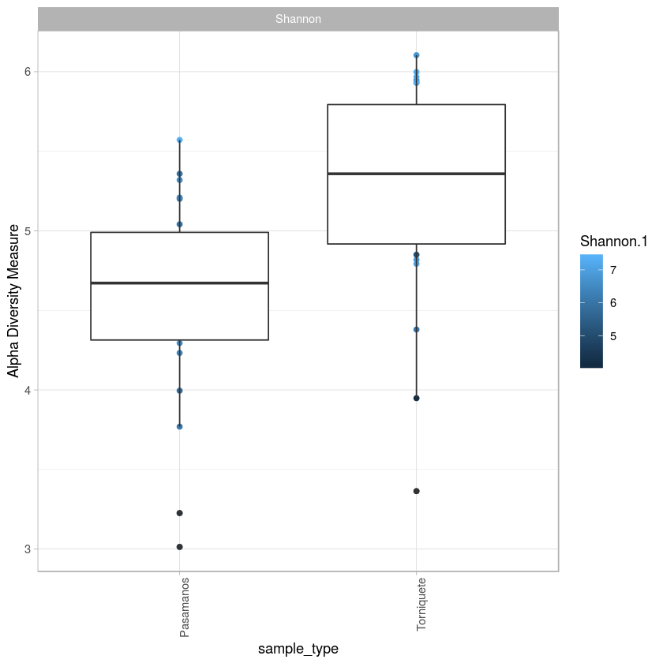


```R
library(ggrepel)
p <- plot_richness(metro, x="sample_type",color="Shannon.1", measures= "Shannon") 
p +  geom_point(size=5, alpha=1) +   scale_fill_gradient(low="#F1E8FA", high="#FA7500", na.value = "white") + theme_light() + theme(axis.text.x=element_text(angle=90, hjust=1))


a<-as.data.frame(p$data)

head(a)
# head(p$data$id)
# head(a)
shannonplot <- ggplot(a, aes(x=a$sample_type, y=(a$Shannon.1))) + geom_point(aes(colour=a$Shannon.1), size=5) + scale_colour_gradient(low="#bebebe", high="#000000", na.value = "white")+ theme_light() + 
# geom_text(aes(label=a$id), hjust=-0.1, vjust=0, size=2) + 
xlab("") + ylab("Shannon")

shannonplot + geom_label_repel(aes(label = a$id),
                  box.padding   = 0.35, 
                  point.padding = 0.5,
                  segment.color = 'blue', size=2)


# ggplot(data=yx, aes(x = yx$orden, y= reorder(Genus, Abundance), fill= Abundance))  + 
#    geom_raster() + theme_minimal () +
#    xlab("") + ylab("") +
#    scale_fill_gradient(low="#bebebe", high="#000000", na.value = "white", trans = "log10") +
#    theme(axis.text.x = element_text( angle = 90, hjust = 1),
#          axis.text.y = element_text(size = 4))
# write.csv(a,"shannon.estacion.csv",sep="\t")


# library(ggplot2)
# library(ggrepel)

# nba <- read.csv("http://datasets.flowingdata.com/ppg2008.csv", sep = ",")

# nbaplot <- ggplot(nba, aes(x= MIN, y = PTS)) + 
#   geom_point(color = "blue", size = 3)

# ### geom_label_repel
# nbaplot + 
#   geom_label_repel(aes(label = Name),
#                   box.padding   = 0.35, 
#                   point.padding = 0.5,
#                   segment.color = 'grey50') +
#   theme_classic()


```


<table>
<thead><tr><th scope=col>id</th><th scope=col>sample_location</th><th scope=col>sample_id</th><th scope=col>line_number</th><th scope=col>sample_type</th><th scope=col>date</th><th scope=col>time</th><th scope=col>temperature_C</th><th scope=col>Humidity</th><th scope=col>length_underground</th><th scope=col>⋯</th><th scope=col>longitude</th><th scope=col>people_affluence</th><th scope=col>Observed</th><th scope=col>Chao1</th><th scope=col>Shannon.1</th><th scope=col>Simpson</th><th scope=col>samples</th><th scope=col>variable</th><th scope=col>value</th><th scope=col>se</th></tr></thead>
<tbody>
	<tr><td>Indios_verdes_3         </td><td>Indios_verdes           </td><td>AM01                    </td><td>3                       </td><td>Torniquete              </td><td>2/5/16                  </td><td>2:23:00 PM              </td><td>30.4                    </td><td>27                      </td><td>18.145                  </td><td>⋯                       </td><td>-99.11940               </td><td>10176457                </td><td>12677                   </td><td>19699.2193              </td><td>7.160039                </td><td>0.9921556               </td><td>AM01                    </td><td>Shannon                 </td><td>5.135283                </td><td>NA                      </td></tr>
	<tr><td>Instituto_del_petroleo_5</td><td>Instituto_del_petroleo  </td><td>AM02                    </td><td>5                       </td><td>Torniquete              </td><td>4/16/29                 </td><td>1:17:00 PM              </td><td>28.3                    </td><td>30                      </td><td> 4.951                  </td><td>⋯                       </td><td>-99.14480               </td><td>  499350                </td><td>10722                   </td><td>16496.3811              </td><td>6.417885                </td><td>0.9890120               </td><td>AM02                    </td><td>Shannon                 </td><td>5.510396                </td><td>NA                      </td></tr>
	<tr><td>Rosario_7               </td><td>Rosario                 </td><td>AM03                    </td><td>7                       </td><td>Torniquete              </td><td>4/16/29                 </td><td>12:40:00 PM             </td><td>29.2                    </td><td>29                      </td><td>17.754                  </td><td>⋯                       </td><td>-99.17970               </td><td> 3220719                </td><td>11986                   </td><td>18521.1304              </td><td>6.718174                </td><td>0.9892510               </td><td>AM03                    </td><td>Shannon                 </td><td>4.939963                </td><td>NA                      </td></tr>
	<tr><td>Cuatro_caminos_2        </td><td>Cuatro_caminos          </td><td>AM04                    </td><td>2                       </td><td>Torniquete              </td><td>4/16/29                 </td><td>11:42:00 AM             </td><td>30.3                    </td><td>30                      </td><td>12.550                  </td><td>⋯                       </td><td>-99.21550               </td><td> 9523016                </td><td> 5425                   </td><td> 8341.2612              </td><td>6.283001                </td><td>0.9939737               </td><td>AM04                    </td><td>Shannon                 </td><td>5.946868                </td><td>NA                      </td></tr>
	<tr><td>Tacubaya_9              </td><td>Tacubaya                </td><td>AM05                    </td><td>9                       </td><td>Torniquete              </td><td>4/16/27                 </td><td>1:41:00 PM              </td><td>30.4                    </td><td>26                      </td><td> 9.531                  </td><td>⋯                       </td><td>-99.18830               </td><td> 4190568                </td><td>  428                   </td><td>  840.2462              </td><td>5.309640                </td><td>0.9899266               </td><td>AM05                    </td><td>Shannon                 </td><td>3.363853                </td><td>NA                      </td></tr>
	<tr><td>Observatorio_1          </td><td>Observatorio            </td><td>AM06                    </td><td>1                       </td><td>Torniquete              </td><td>4/5/16                  </td><td>2:35:00 PM              </td><td>32.2                    </td><td>28                      </td><td>16.786                  </td><td>⋯                       </td><td>-99.19978               </td><td> 6489055                </td><td>10523                   </td><td>17035.5115              </td><td>6.437592                </td><td>0.9859032               </td><td>AM06                    </td><td>Shannon                 </td><td>5.133815                </td><td>NA                      </td></tr>
</tbody>
</table>


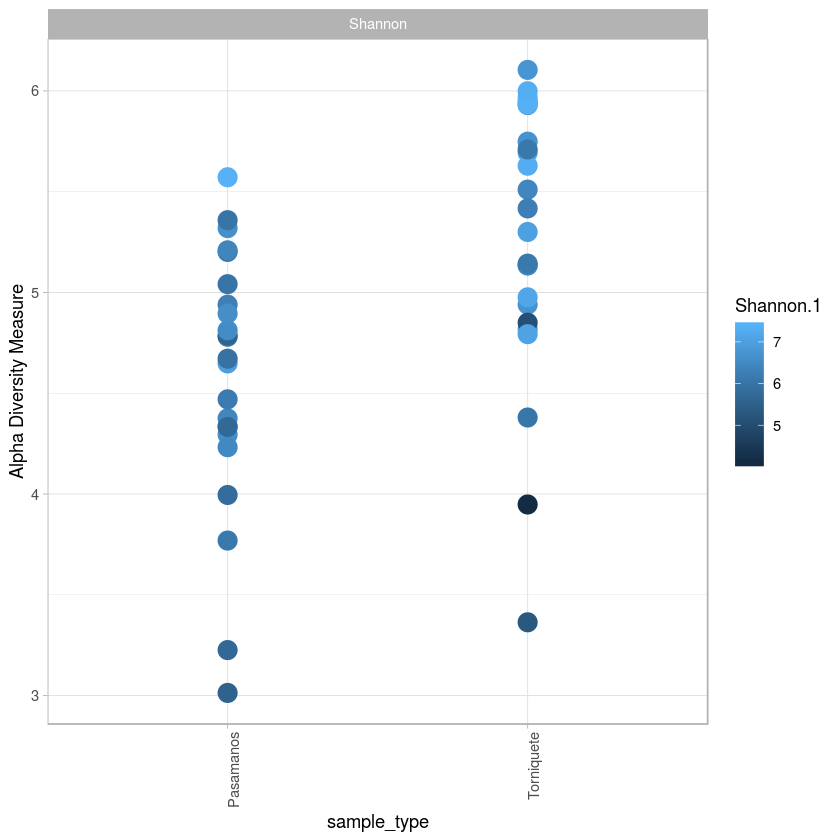


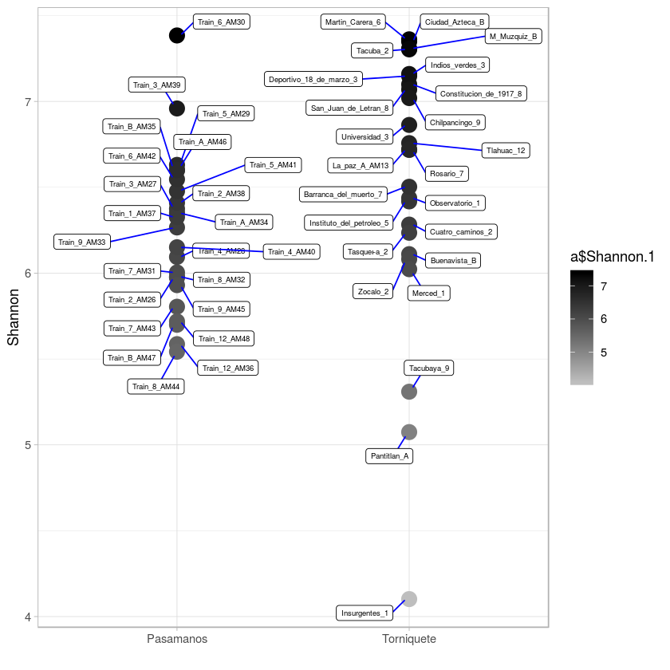


```R
library(ggrepel)
p <- plot_richness(metro, x="sample_type",color="Shannon.1", measures= "Shannon") 
p + geom_violin()+ geom_point(aes(colour=a$Shannon.1),size=5, alpha=1) + scale_colour_gradient(low="#bebebe", high="#000000", na.value = "white") + theme_light() + theme(axis.text.x=element_text(angle=90, hjust=1))

```


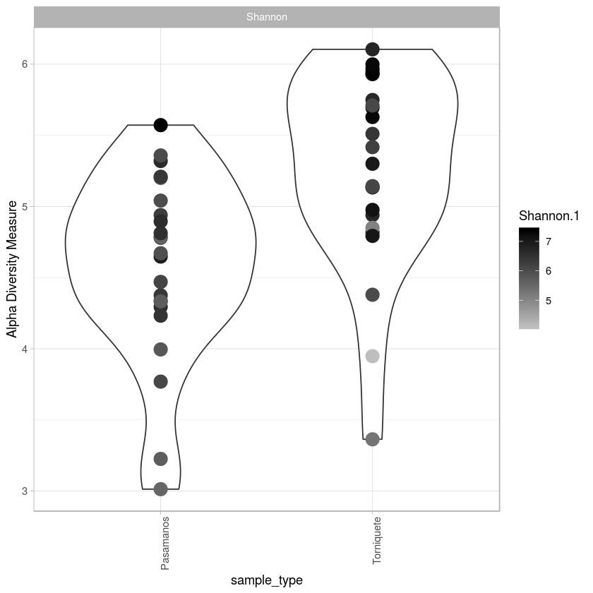


```R
library(dplyr)


p <- plot_richness(metro, measures=c("Observed", "Chao1", "Shannon", "Simpson")) + geom_boxplot()+theme_light() + theme(axis.text.x=element_text(angle=90, hjust=1))
#p$data
#a <-p$data
#summary(a)
#write.table(a, "data.csv") Se edita para dejar en el formato id	Observed	Chao1	Shannon	Simpson
meta <- read.table("THEmetadata.txt",sep="\t",header=T,row.names = 1) #data.csv se hizo a partir de la tabla anterior para calcular
#los datos de diversidad alfa
head(meta)
summary(meta)

hist(meta$Observed, breaks=10)
hist(meta$Chao1, breaks=10)
hist(meta$Shannon, breaks=10)
hist(meta$Simpson, breaks=10)

```


<table>
<thead><tr><th></th><th scope=col>otu</th><th scope=col>id</th><th scope=col>sample_location</th><th scope=col>sample_id</th><th scope=col>line_number</th><th scope=col>sample_type</th><th scope=col>date</th><th scope=col>time</th><th scope=col>temperature_C</th><th scope=col>Humidity</th><th scope=col>⋯</th><th scope=col>geographical_zone</th><th scope=col>weather</th><th scope=col>stations_number</th><th scope=col>latitude</th><th scope=col>longitude</th><th scope=col>people_affluence</th><th scope=col>Observed</th><th scope=col>Chao1</th><th scope=col>Shannon</th><th scope=col>Simpson</th></tr></thead>
<tbody>
	<tr><th scope=row>AM01</th><td>Indios_verdes_3         </td><td>Indios_verdes_3         </td><td>Indios_verdes           </td><td>AM01                    </td><td>3                       </td><td>Torniquete              </td><td>2/5/16                  </td><td>2:23:00 PM              </td><td>30.4                    </td><td>27                      </td><td>⋯                       </td><td>Norte                   </td><td>C1                      </td><td>21                      </td><td>19.4955                 </td><td>-99.11940               </td><td>10176457                </td><td>12677                   </td><td>19699.2193              </td><td>7.160039                </td><td>0.9921556               </td></tr>
	<tr><th scope=row>AM02</th><td>Instituto_del_petroleo_5</td><td>Instituto_del_petroleo_5</td><td>Instituto_del_petroleo  </td><td>AM02                    </td><td>5                       </td><td>Torniquete              </td><td>4/16/29                 </td><td>1:17:00 PM              </td><td>28.3                    </td><td>30                      </td><td>⋯                       </td><td>Norte                   </td><td>C1                      </td><td>13                      </td><td>19.4890                 </td><td>-99.14480               </td><td>  499350                </td><td>10722                   </td><td>16496.3811              </td><td>6.417885                </td><td>0.9890120               </td></tr>
	<tr><th scope=row>AM03</th><td>Rosario_7               </td><td>Rosario_7               </td><td>Rosario                 </td><td>AM03                    </td><td>7                       </td><td>Torniquete              </td><td>4/16/29                 </td><td>12:40:00 PM             </td><td>29.2                    </td><td>29                      </td><td>⋯                       </td><td>Norte                   </td><td>C1                      </td><td>14                      </td><td>19.5050                 </td><td>-99.17970               </td><td> 3220719                </td><td>11986                   </td><td>18521.1304              </td><td>6.718174                </td><td>0.9892510               </td></tr>
	<tr><th scope=row>AM04</th><td>Cuatro_caminos_2        </td><td>Cuatro_caminos_2        </td><td>Cuatro_caminos          </td><td>AM04                    </td><td>2                       </td><td>Torniquete              </td><td>4/16/29                 </td><td>11:42:00 AM             </td><td>30.3                    </td><td>30                      </td><td>⋯                       </td><td>Poniente                </td><td>C2                      </td><td>24                      </td><td>19.4606                 </td><td>-99.21550               </td><td> 9523016                </td><td> 5425                   </td><td> 8341.2612              </td><td>6.283001                </td><td>0.9939737               </td></tr>
	<tr><th scope=row>AM05</th><td>Tacubaya_9              </td><td>Tacubaya_9              </td><td>Tacubaya                </td><td>AM05                    </td><td>9                       </td><td>Torniquete              </td><td>4/16/27                 </td><td>1:41:00 PM              </td><td>30.4                    </td><td>26                      </td><td>⋯                       </td><td>Poniente                </td><td>C1                      </td><td>12                      </td><td>19.4024                 </td><td>-99.18830               </td><td> 4190568                </td><td>  428                   </td><td>  840.2462              </td><td>5.309640                </td><td>0.9899266               </td></tr>
	<tr><th scope=row>AM06</th><td>Observatorio_1          </td><td>Observatorio_1          </td><td>Observatorio            </td><td>AM06                    </td><td>1                       </td><td>Torniquete              </td><td>4/5/16                  </td><td>2:35:00 PM              </td><td>32.2                    </td><td>28                      </td><td>⋯                       </td><td>Poniente                </td><td>C2                      </td><td>20                      </td><td>19.3985                 </td><td>-99.19978               </td><td> 6489055                </td><td>10523                   </td><td>17035.5115              </td><td>6.437592                </td><td>0.9859032               </td></tr>
</tbody>
</table>


                         otu                          id    
     Barranca_del_muerto_7 : 1   Barranca_del_muerto_7 : 1  
     Buenavista_B          : 1   Buenavista_B          : 1  
     Chilpancingo_9        : 1   Chilpancingo_9        : 1  
     Ciudad_Azteca_B       : 1   Ciudad_Azteca_B       : 1  
     Constitucion_de_1917_8: 1   Constitucion_de_1917_8: 1  
     Cuatro_caminos_2      : 1   Cuatro_caminos_2      : 1  
     (Other)               :41   (Other)               :41  
                 sample_location   sample_id   line_number     sample_type
     Train               :23     AM01   : 1   2      : 6   Pasamanos :23  
     Barranca_del_muerto : 1     AM02   : 1   11(B)  : 5   Torniquete:24  
     Buenavista          : 1     AM03   : 1   3      : 5                  
     Chilpancingo        : 1     AM04   : 1   1      : 4                  
     Ciudad_Azteca       : 1     AM05   : 1   10(A)  : 4                  
     Constitucion_de_1917: 1     AM06   : 1   7      : 4                  
     (Other)             :19     (Other):41   (Other):19                  
          date             time    temperature_C      Humidity    
     2/5/16 : 9   11:25:00 AM: 2   Min.   :25.90   Min.   :25.00  
     3/5/16 : 7   11:42:00 AM: 2   1st Qu.:29.10   1st Qu.:27.00  
     4/16/27: 9   1:20:00 PM : 2   Median :30.40   Median :30.00  
     4/16/28: 6   12:05:00 PM: 2   Mean   :30.15   Mean   :30.38  
     4/16/29:10   12:40:00 PM: 2   3rd Qu.:31.30   3rd Qu.:32.00  
     4/5/16 : 6   12:50:00 PM: 2   Max.   :33.30   Max.   :41.00  
                  (Other)    :35                                  
     length_underground length_superficial length_elevated   length_total  
     Min.   : 0.00      Min.   : 0.000     Min.   : 0.000   Min.   :11.00  
     1st Qu.: 5.38      1st Qu.: 0.000     1st Qu.: 0.000   1st Qu.:16.50  
     Median :11.86      Median : 4.449     Median : 0.000   Median :18.00  
     Mean   :11.05      Mean   : 5.485     Mean   : 2.001   Mean   :18.83  
     3rd Qu.:16.79      3rd Qu.:10.090     3rd Qu.: 4.185   3rd Qu.:22.00  
     Max.   :18.14      Max.   :15.151     Max.   :11.533   Max.   :25.00  
                                                                           
       elevation                      station_hubs    train_track
     Min.   :2231   Correspondecia          : 3    Ferreo   : 7  
     1st Qu.:2237   Paso                    : 6    Neumatico:40  
     Median :2242   Terminal                :11                  
     Mean   :2250   Terminal_correspondencia: 4                  
     3rd Qu.:2256   Train                   :23                  
     Max.   :2303                                                
     NA's   :23                                                  
            train_notes           station_notes geographical_zone weather  
     Independiente:34   Cajon_subterraneo:11    Centro  : 5       B1  : 4  
     Oruga        :13   Elevada          : 9    Norte   : 7       C1  :16  
                        Superficial      : 3    Oriente : 5       C2  : 4  
                        Tunel            : 1    Poniente: 3       NA's:23  
                        NA's             :23    Sur     : 4                
                                                NA's    :23                
                                                                           
     stations_number    latitude       longitude      people_affluence  
     Min.   :10.00   Min.   :19.29   Min.   :-99.22   Min.   :  499350  
     1st Qu.:12.00   1st Qu.:19.39   1st Qu.:-99.17   1st Qu.: 4284103  
     Median :19.00   Median :19.43   Median :-99.14   Median : 9523016  
     Mean   :17.15   Mean   :19.43   Mean   :-99.13   Mean   :17859153  
     3rd Qu.:21.00   3rd Qu.:19.49   3rd Qu.:-99.10   3rd Qu.:24196452  
     Max.   :24.00   Max.   :19.53   Max.   :-98.96   Max.   :66232325  
                     NA's   :23      NA's   :23                         
        Observed         Chao1            Shannon         Simpson      
     Min.   :  428   Min.   :  840.2   Min.   :4.102   Min.   :0.8984  
     1st Qu.: 7732   1st Qu.:12826.6   1st Qu.:6.014   1st Qu.:0.9813  
     Median :10129   Median :15375.8   Median :6.410   Median :0.9872  
     Mean   : 9904   Mean   :15141.1   Mean   :6.380   Mean   :0.9827  
     3rd Qu.:12332   3rd Qu.:18371.5   3rd Qu.:6.810   3rd Qu.:0.9915  
     Max.   :16179   Max.   :23052.1   Max.   :7.384   Max.   :0.9960  
                                                                       


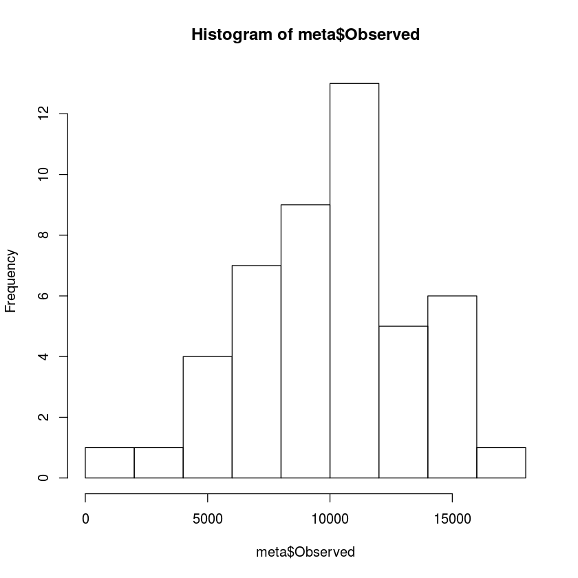


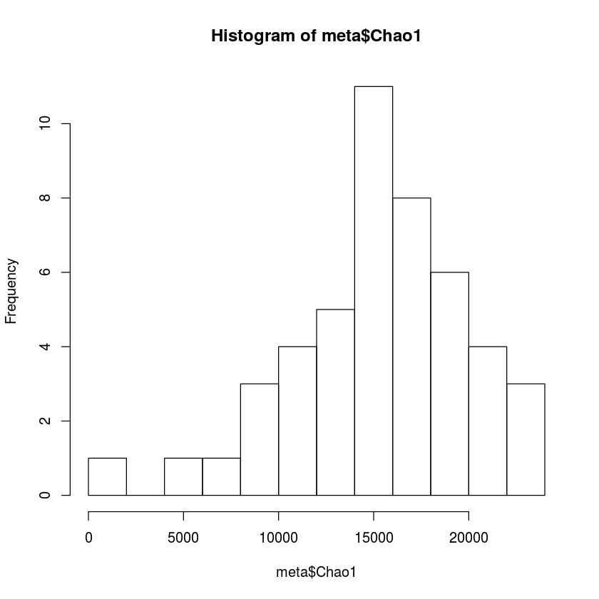


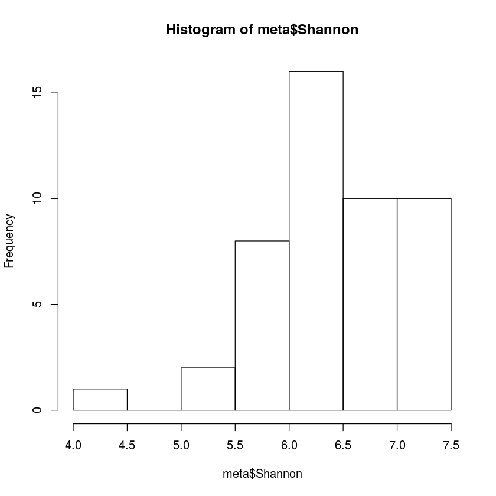


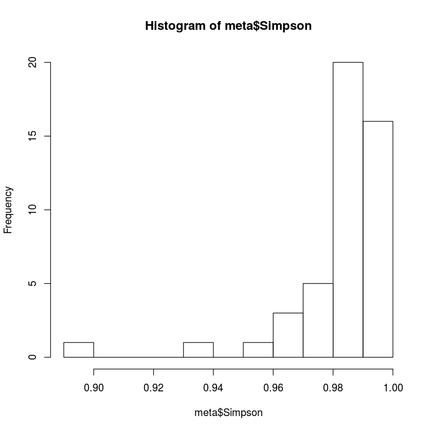


```R
metroCAP.ORD <- ordinate(metro, "CAP", "bray", ~ people_affluence + line_number + sample_type)

metroCAP.ORD

cap_plot <- plot_ordination(metro, metroCAP.ORD, color="line_number", axes =c(1,2)) + aes(shape= sample_type) + geom_point(aes(colour = line_number), alpha=0.4, size=4) + geom_point(colour = "grey90", size=1.5) + theme_bw()


arrowmat <- vegan::scores(metroCAP.ORD, display="bp")
arrowdf <- data.frame(labels=rownames(arrowmat), arrowmat)

# Define the arrow aesthetic mapping

arrow_map <- aes(xend = CAP1, 

    yend = CAP2, 
    x = 0, 
    y = 0, 
    shape = NULL, 
    color = NULL, 
    label = labels)


label_map <- aes(x = 1.3 * CAP1, 

    y = 1.3 * CAP2, 
    shape = NULL, 
    color = NULL, 
    label = labels)


arrowhead = arrow(length = unit(0.02, "npc"))


cap_plot  + 

  geom_segment(
    mapping = arrow_map, 
    size = .5, 
    data = arrowdf, 
    color = "gray", 
    arrow = arrowhead

  ) + 

  geom_text(
    mapping = label_map, 
    size = 2,  
    data = arrowdf, 
    show.legend = FALSE
  )


an <- anova(metroCAP.ORD, permutations=9999)
an

```


    Call: capscale(formula = OTU ~ people_affluence + line_number +
    sample_type, data = data, distance = distance)
    
                  Inertia Proportion Rank
    Total          9.2927     1.0000     
    Constrained    3.0265     0.3257   13
    Unconstrained  6.2662     0.6743   33
    Inertia is squared Bray distance 
    Species scores projected from ‘OTU’ 
    
    Eigenvalues for constrained axes:
      CAP1   CAP2   CAP3   CAP4   CAP5   CAP6   CAP7   CAP8   CAP9  CAP10  CAP11 
    1.0012 0.3099 0.2971 0.2532 0.2313 0.1594 0.1558 0.1498 0.1142 0.1053 0.1002 
     CAP12  CAP13 
    0.0776 0.0716 
    
    Eigenvalues for unconstrained axes:
      MDS1   MDS2   MDS3   MDS4   MDS5   MDS6   MDS7   MDS8 
    0.7839 0.6623 0.5300 0.4344 0.3182 0.3003 0.2666 0.2429 
    (Showing 8 of 33 unconstrained eigenvalues)


    Warning message:
    “Ignoring unknown aesthetics: label”


<table>
<thead><tr><th></th><th scope=col>Df</th><th scope=col>SumOfSqs</th><th scope=col>F</th><th scope=col>Pr(&gt;F)</th></tr></thead>
<tbody>
	<tr><th scope=row>Model</th><td>13      </td><td>3.026498</td><td>1.226055</td><td>0.0074  </td></tr>
	<tr><th scope=row>Residual</th><td>33      </td><td>6.266154</td><td>      NA</td><td>    NA  </td></tr>
</tbody>
</table>


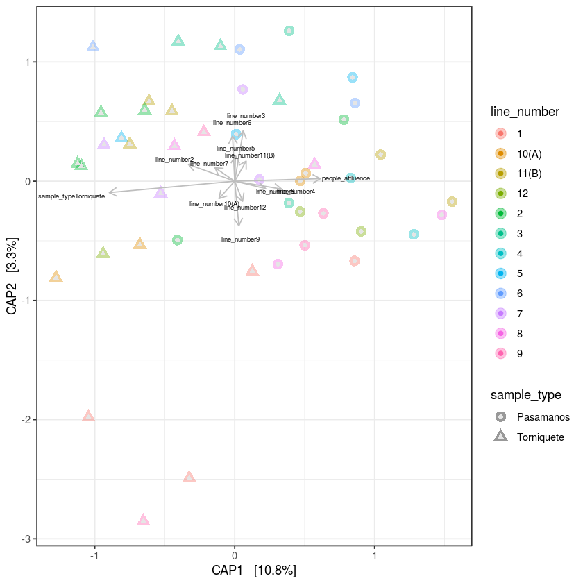


```R
metro
metrito <- get_variable(metro, "sample_type") 

sample_data(metro)$metrito <- factor(metrito)

colorCodes <- levels(metrito)
library(doParallel)
library(RColorBrewer)

#sample_data(march_subset)

# camaronUF <- dist(metro, "bray")

camaronUF <- distance(metro, method='bray')


#colorScale <- colors()[c(26,51,76)]

#colorScale    <-rainbow(length(levels(get_variable(march_subset, "marchantita"))))

colorScale    <- brewer.pal(length(levels(get_variable(metro, "metrito"))),"Dark2")

#colorScale

cols <- colorScale[get_variable(metro, "metrito")] 

#cols

#march.tip.labels <- as(get_variable(march_subset, "marchantita"), "character")

# This is the actual hierarchical clustering call, specifying average-link clustering

camaron.hclust     <- hclust(camaronUF, method="average")

library(dendextend)

dend <- as.dendrogram(camaron.hclust)

labels_colors(dend) <- cols[order.dendrogram(dend)]


dend %>% set("labels_cex", .75) %>% plot(main="Unifrac unweighted distances",horiz=T) 

#ggplot(dend, horiz=T)
```


    phyloseq-class experiment-level object
    otu_table()   OTU Table:         [ 22673 taxa and 47 samples ]
    sample_data() Sample Data:       [ 47 samples by 29 sample variables ]
    tax_table()   Taxonomy Table:    [ 22673 taxa by 6 taxonomic ranks ]


    Warning message in brewer.pal(length(levels(get_variable(metro, "metrito"))), "Dark2"):
    “minimal value for n is 3, returning requested palette with 3 different levels
    ”
    ---------------------
    Welcome to dendextend version 1.10.0
    Type citation('dendextend') for how to cite the package.
    
    Type browseVignettes(package = 'dendextend') for the package vignette.
    The github page is: https://github.com/talgalili/dendextend/
    
    Suggestions and bug-reports can be submitted at: https://github.com/talgalili/dendextend/issues
    Or contact: <tal.galili@gmail.com>
    
    	To suppress this message use:  suppressPackageStartupMessages(library(dendextend))
    ---------------------
    
    
    Attaching package: ‘dendextend’
    
    The following objects are masked from ‘package:ape’:
    
        ladderize, rotate
    
    The following object is masked from ‘package:permute’:
    
        shuffle
    
    The following object is masked from ‘package:stats’:
    
        cutree
    


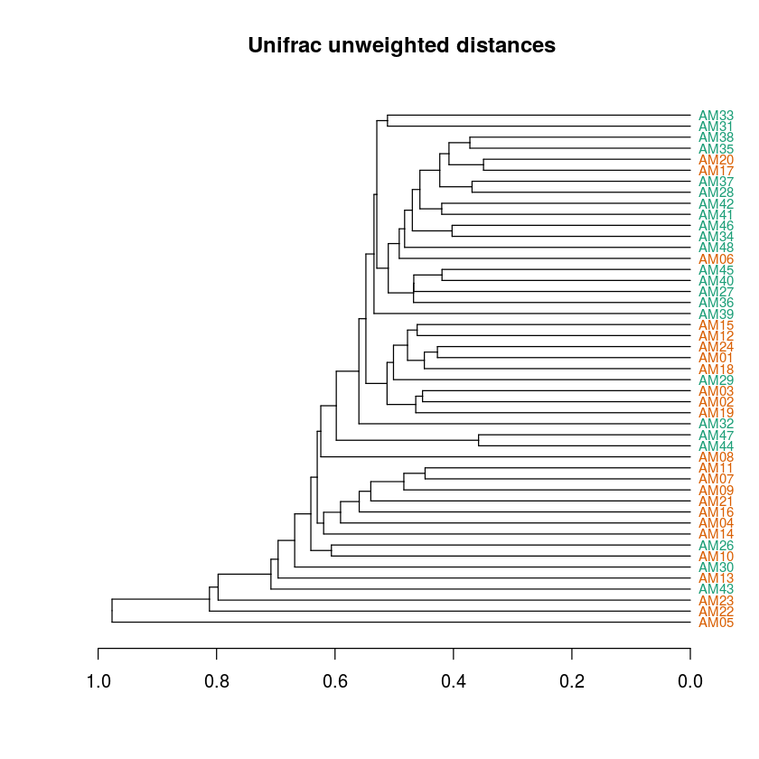


```R
library(UpSetR)
library(grid)
merge2 = merge_samples(metro, "line_number")
merge2 <- as.table(t(otu_table(merge2)))
merge2 <- replace(merge2, merge2>0, 1)
write.table(merge2,"merge2.tmp")

merge2 <- read.table("merge2.tmp", header=TRUE, row.names = 1)
head(merge2)
#merge2[order(rowSums(merge2),decreasing=T),] #
upset(merge2, sets = c('X1','X2','X3','X4','X5','X6','X7','X8','X9','X10.A.','X11.B.', 'X12'), 
      sets.bar.color = "#56B4E9", order.by = "freq", empty.intersections = "on")


```


<table>
<thead><tr><th></th><th scope=col>X1</th><th scope=col>X10.A.</th><th scope=col>X11.B.</th><th scope=col>X12</th><th scope=col>X2</th><th scope=col>X3</th><th scope=col>X4</th><th scope=col>X5</th><th scope=col>X6</th><th scope=col>X7</th><th scope=col>X8</th><th scope=col>X9</th></tr></thead>
<tbody>
	<tr><th scope=row>ASV_1</th><td>1</td><td>1</td><td>1</td><td>1</td><td>1</td><td>1</td><td>1</td><td>1</td><td>1</td><td>1</td><td>1</td><td>1</td></tr>
	<tr><th scope=row>ASV_2</th><td>1</td><td>1</td><td>1</td><td>1</td><td>1</td><td>1</td><td>1</td><td>1</td><td>1</td><td>1</td><td>1</td><td>1</td></tr>
	<tr><th scope=row>ASV_3</th><td>1</td><td>1</td><td>1</td><td>1</td><td>1</td><td>1</td><td>1</td><td>1</td><td>1</td><td>1</td><td>1</td><td>1</td></tr>
	<tr><th scope=row>ASV_4</th><td>1</td><td>1</td><td>1</td><td>1</td><td>1</td><td>1</td><td>1</td><td>1</td><td>1</td><td>1</td><td>1</td><td>1</td></tr>
	<tr><th scope=row>ASV_5</th><td>1</td><td>1</td><td>1</td><td>1</td><td>1</td><td>1</td><td>1</td><td>1</td><td>1</td><td>1</td><td>1</td><td>1</td></tr>
	<tr><th scope=row>ASV_6</th><td>1</td><td>1</td><td>1</td><td>1</td><td>1</td><td>1</td><td>1</td><td>1</td><td>1</td><td>1</td><td>1</td><td>1</td></tr>
</tbody>
</table>


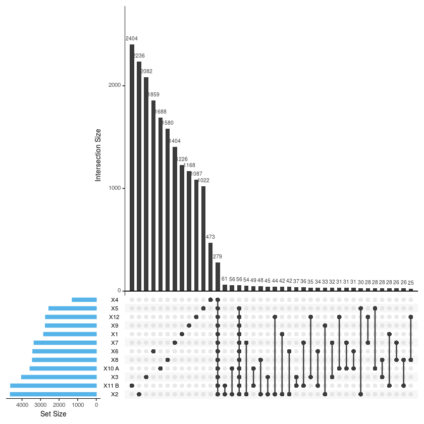


```R
x3 <- tax_glom(metro, taxrank="Genus")
merge2 = merge_samples(x3, "line_number")
merge2 <- as.table(t(otu_table(merge2)))
merge2 <- replace(merge2, merge2>0, 1)
write.table(merge2,"merge2.tmp")

merge2 <- read.table("merge2.tmp", header=TRUE, row.names = 1)
head(merge2)
#merge2[order(rowSums(merge2),decreasing=T),] #
upset(merge2, sets = c('X1','X2','X3','X4','X5','X6','X7','X8','X9','X10.A.','X11.B.', 'X12'), 
      sets.bar.color = "#56B4E9", order.by = "freq", empty.intersections = "on")


upset(merge2, sets = c('X1','X2','X3','X4','X5','X6','X7','X8','X9','X10.A.','X11.B.', 'X12'), 
      sets.bar.color = "#56B4E9", order.by = "freq", empty.intersections = "on")
ggsave("upset_lines.pdf", width= 10, height= 10, onefile=FALSE)
```


<table>
<thead><tr><th></th><th scope=col>X1</th><th scope=col>X10.A.</th><th scope=col>X11.B.</th><th scope=col>X12</th><th scope=col>X2</th><th scope=col>X3</th><th scope=col>X4</th><th scope=col>X5</th><th scope=col>X6</th><th scope=col>X7</th><th scope=col>X8</th><th scope=col>X9</th></tr></thead>
<tbody>
	<tr><th scope=row>ASV_1</th><td>1</td><td>1</td><td>1</td><td>1</td><td>1</td><td>1</td><td>1</td><td>1</td><td>1</td><td>1</td><td>1</td><td>1</td></tr>
	<tr><th scope=row>ASV_2</th><td>1</td><td>1</td><td>1</td><td>1</td><td>1</td><td>1</td><td>1</td><td>1</td><td>1</td><td>1</td><td>1</td><td>1</td></tr>
	<tr><th scope=row>ASV_3</th><td>1</td><td>1</td><td>1</td><td>1</td><td>1</td><td>1</td><td>1</td><td>1</td><td>1</td><td>1</td><td>1</td><td>1</td></tr>
	<tr><th scope=row>ASV_4</th><td>1</td><td>1</td><td>1</td><td>1</td><td>1</td><td>1</td><td>1</td><td>1</td><td>1</td><td>1</td><td>1</td><td>1</td></tr>
	<tr><th scope=row>ASV_5</th><td>1</td><td>1</td><td>1</td><td>1</td><td>1</td><td>1</td><td>1</td><td>1</td><td>1</td><td>1</td><td>1</td><td>1</td></tr>
	<tr><th scope=row>ASV_6</th><td>1</td><td>1</td><td>1</td><td>1</td><td>1</td><td>1</td><td>1</td><td>1</td><td>1</td><td>1</td><td>1</td><td>1</td></tr>
</tbody>
</table>


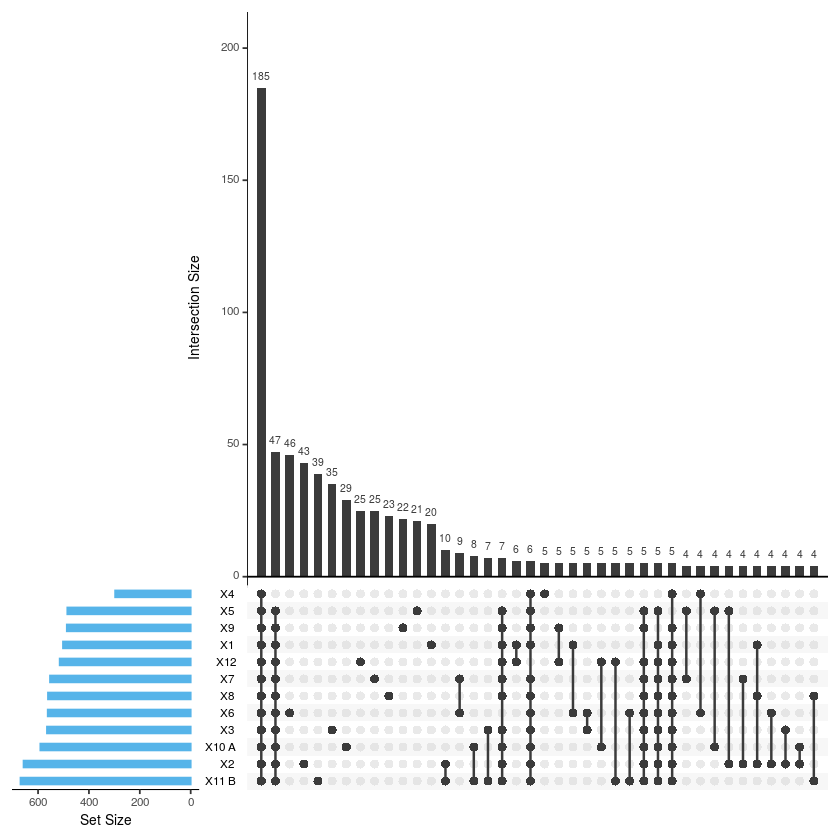


```R
#Función para calcular las intersecciones get_intersect_members


get_intersect_members <- function (x, ...){
  require(dplyr)
  require(tibble)
  x <- x[,sapply(x, is.numeric)][,0<=colMeans(x[,sapply(x, is.numeric)],na.rm=T) & colMeans(x[,sapply(x, is.numeric)],na.rm=T)<=1]
  n <- names(x)
  x %>% rownames_to_column() -> x
  l <- c(...)
  a <- intersect(names(x), l)
  ar <- vector('list',length(n)+1)
  ar[[1]] <- x
  i=2
  for (item in n) {
    if (item %in% a){
      if (class(x[[item]])=='integer'){
        ar[[i]] <- paste(item, '>= 1')
        i <- i + 1
      }
    } else {
      if (class(x[[item]])=='integer'){
        ar[[i]] <- paste(item, '== 0')
        i <- i + 1
      }
    }
  }
  do.call(filter_, ar) %>% column_to_rownames() -> x
  return(x)
}
```


```R
intersect <- get_intersect_members(merge2,c('X1','X2','X3','X4','X5','X6','X7','X8','X9','X10.A.','X11.B.', 'X12')) #intersección del core, se puede cambiar para cualquier subconjunto de intersecciones!
length(row.names(intersect)) #número de elementos del core

intersect <- (row.names(intersect)) #identidades del core
vec <- setNames(nm=c(intersect))
# vec
```


185


```R
physeqsubsetOTU <- subset_taxa(x3, rownames(tax_table(x3)) %in% vec)
mergeph1 <- merge_samples(physeqsubsetOTU, "line_number")
mergeph1 = transform_sample_counts(mergeph1,function(x) x/sum(x))

    write.table(t(otu_table(mergeph1)),"heatmap_core-lineas.csv",sep="\t")
     write.table(tax_table(mergeph1),"heatmap_core-lineas.tax.csv",sep="\t")
    system("paste heatmap_core-lineas.csv heatmap_core-lineas.tax.csv >heatmap_core-lineas.otutax.csv" )

t1 <- as.data.frame(colSums(otu_table(mergeph1)))

# write.table(t, "vennupset.txt") 
t <-(tax_table(mergeph1)) #hago esto porque el melt sobre este objeto phyloseq no trabaja, creo que hay que usar psmelt para esto

write.table(t, "taxvennupset.txt") 
t <- as.data.frame(read.table("taxvennupset.txt", header=T, row.names = 1))

# system("paste vennupset.txt taxvennupset.txt >coreupset.txt")

# read.table("coreupset.txt", header=T, sep="\t") 
t3 <- merge(t,t1, by=0, all=TRUE )

    head(t3)                               
names(t3)[8] <-"abundance"

t4 <- t3[order(-t3$abundance),]
write.table(t4, "taxvennupset-Entrada-Salida.txt")
 t5 <-   as.vector(t4$Row.names)
t5
t4
summary(t4)                                  
                                   
                                   
p <- plot_bar(mergeph1, "Genus")

yx <- p$data
    
    yx <- as.data.frame(yx)
head(yx)
yx <- yx[order(-yx$Abundance),]

head(yx)
levels1=c('1','2','3','4','5','6','7','8','9','10(A)','11(B)','12')
levels1
levels2 = rev(t5)

yx$orden <- factor(yx$Sample, levels = levels1)
yx$abun <- factor(yx$OTU, levels= levels2)
head(yx$abun)
                                   
                                     #Correción a valores vacios en Género 
    
    ylabvec = as(tax_table(mergeph1)[,"Genus"], "character")
names(ylabvec) <- taxa_names(mergeph1)
ylabvec[is.na(ylabvec)] <- ""
    
    #####

# ggplot(data=yx, aes(x = yx$orden, y= reorder(Genus, Abundance), fill= Abundance))  + 
#    geom_raster() + theme_minimal () +
#    xlab("") + ylab("") +
#    scale_fill_gradient(low="#bebebe", high="#000000", na.value = "white", trans = "log10") +
#    theme(axis.text.x = element_text( angle = 90, hjust = 1),
#          axis.text.y = element_text(size = 4.2))
                                   
                             
                                   
```


<table>
<thead><tr><th scope=col>Row.names</th><th scope=col>Kingdom</th><th scope=col>Phylum</th><th scope=col>Class</th><th scope=col>Order</th><th scope=col>Family</th><th scope=col>Genus</th><th scope=col>colSums(otu_table(mergeph1))</th></tr></thead>
<tbody>
	<tr><td>ASV_1                                 </td><td>Bacteria                              </td><td>Actinobacteriota                      </td><td>Actinobacteria                        </td><td>Propionibacteriales                   </td><td>Propionibacteriaceae                  </td><td>Cutibacterium                         </td><td>2.290667670                           </td></tr>
	<tr><td>ASV_1007                              </td><td>Bacteria                              </td><td>Firmicutes                            </td><td>Clostridia                            </td><td>Clostridia_or                         </td><td>Hungateiclostridiaceae                </td><td>Fastidiosipila                        </td><td>0.001820265                           </td></tr>
	<tr><td>ASV_101                               </td><td>Bacteria                              </td><td>Proteobacteria                        </td><td>Alphaproteobacteria                   </td><td>Azospirillales                        </td><td>Azospirillaceae                       </td><td>Skermanella                           </td><td>0.020332544                           </td></tr>
	<tr><td>ASV_1027                              </td><td>Bacteria                              </td><td>Firmicutes                            </td><td>Clostridia                            </td><td>Peptostreptococcales-Tissierellales   </td><td>Peptostreptococcales-Tissierellales_fa</td><td>Murdochiella                          </td><td>0.001554152                           </td></tr>
	<tr><td>ASV_1039                              </td><td>Bacteria                              </td><td>Bacteroidota                          </td><td>Bacteroidia                           </td><td>Cytophagales                          </td><td>Hymenobacteraceae                     </td><td>Adhaeribacter                         </td><td>0.005039240                           </td></tr>
	<tr><td>ASV_1044                              </td><td>Bacteria                              </td><td>Firmicutes                            </td><td>Clostridia                            </td><td>Lachnospirales                        </td><td>Lachnospiraceae                       </td><td>Lachnoclostridium                     </td><td>0.001689947                           </td></tr>
</tbody>
</table>


<ol class=list-inline>
	<li>'ASV_1'</li>
	<li>'ASV_2'</li>
	<li>'ASV_6'</li>
	<li>'ASV_5'</li>
	<li>'ASV_4'</li>
	<li>'ASV_3'</li>
	<li>'ASV_13'</li>
	<li>'ASV_26'</li>
	<li>'ASV_19'</li>
	<li>'ASV_9'</li>
	<li>'ASV_70'</li>
	<li>'ASV_18'</li>
	<li>'ASV_90'</li>
	<li>'ASV_96'</li>
	<li>'ASV_17'</li>
	<li>'ASV_16'</li>
	<li>'ASV_43'</li>
	<li>'ASV_28'</li>
	<li>'ASV_14'</li>
	<li>'ASV_304'</li>
	<li>'ASV_31'</li>
	<li>'ASV_58'</li>
	<li>'ASV_129'</li>
	<li>'ASV_42'</li>
	<li>'ASV_35'</li>
	<li>'ASV_27'</li>
	<li>'ASV_41'</li>
	<li>'ASV_123'</li>
	<li>'ASV_32'</li>
	<li>'ASV_82'</li>
	<li>'ASV_91'</li>
	<li>'ASV_251'</li>
	<li>'ASV_66'</li>
	<li>'ASV_56'</li>
	<li>'ASV_62'</li>
	<li>'ASV_184'</li>
	<li>'ASV_171'</li>
	<li>'ASV_168'</li>
	<li>'ASV_95'</li>
	<li>'ASV_128'</li>
	<li>'ASV_109'</li>
	<li>'ASV_36'</li>
	<li>'ASV_134'</li>
	<li>'ASV_46'</li>
	<li>'ASV_52'</li>
	<li>'ASV_206'</li>
	<li>'ASV_60'</li>
	<li>'ASV_54'</li>
	<li>'ASV_270'</li>
	<li>'ASV_265'</li>
	<li>'ASV_412'</li>
	<li>'ASV_106'</li>
	<li>'ASV_68'</li>
	<li>'ASV_77'</li>
	<li>'ASV_97'</li>
	<li>'ASV_202'</li>
	<li>'ASV_137'</li>
	<li>'ASV_455'</li>
	<li>'ASV_256'</li>
	<li>'ASV_74'</li>
	<li>'ASV_317'</li>
	<li>'ASV_67'</li>
	<li>'ASV_117'</li>
	<li>'ASV_126'</li>
	<li>'ASV_150'</li>
	<li>'ASV_118'</li>
	<li>'ASV_110'</li>
	<li>'ASV_471'</li>
	<li>'ASV_253'</li>
	<li>'ASV_101'</li>
	<li>'ASV_238'</li>
	<li>'ASV_447'</li>
	<li>'ASV_360'</li>
	<li>'ASV_259'</li>
	<li>'ASV_125'</li>
	<li>'ASV_193'</li>
	<li>'ASV_541'</li>
	<li>'ASV_397'</li>
	<li>'ASV_170'</li>
	<li>'ASV_245'</li>
	<li>'ASV_138'</li>
	<li>'ASV_450'</li>
	<li>'ASV_112'</li>
	<li>'ASV_136'</li>
	<li>'ASV_151'</li>
	<li>'ASV_342'</li>
	<li>'ASV_274'</li>
	<li>'ASV_194'</li>
	<li>'ASV_485'</li>
	<li>'ASV_431'</li>
	<li>'ASV_469'</li>
	<li>'ASV_220'</li>
	<li>'ASV_543'</li>
	<li>'ASV_367'</li>
	<li>'ASV_178'</li>
	<li>'ASV_1064'</li>
	<li>'ASV_215'</li>
	<li>'ASV_681'</li>
	<li>'ASV_153'</li>
	<li>'ASV_510'</li>
	<li>'ASV_320'</li>
	<li>'ASV_285'</li>
	<li>'ASV_191'</li>
	<li>'ASV_433'</li>
	<li>'ASV_651'</li>
	<li>'ASV_214'</li>
	<li>'ASV_372'</li>
	<li>'ASV_250'</li>
	<li>'ASV_174'</li>
	<li>'ASV_388'</li>
	<li>'ASV_482'</li>
	<li>'ASV_357'</li>
	<li>'ASV_2015'</li>
	<li>'ASV_188'</li>
	<li>'ASV_204'</li>
	<li>'ASV_226'</li>
	<li>'ASV_219'</li>
	<li>'ASV_849'</li>
	<li>'ASV_319'</li>
	<li>'ASV_519'</li>
	<li>'ASV_355'</li>
	<li>'ASV_440'</li>
	<li>'ASV_407'</li>
	<li>'ASV_449'</li>
	<li>'ASV_901'</li>
	<li>'ASV_435'</li>
	<li>'ASV_386'</li>
	<li>'ASV_553'</li>
	<li>'ASV_418'</li>
	<li>'ASV_815'</li>
	<li>'ASV_873'</li>
	<li>'ASV_1379'</li>
	<li>'ASV_1110'</li>
	<li>'ASV_1039'</li>
	<li>'ASV_445'</li>
	<li>'ASV_678'</li>
	<li>'ASV_326'</li>
	<li>'ASV_942'</li>
	<li>'ASV_3196'</li>
	<li>'ASV_375'</li>
	<li>'ASV_609'</li>
	<li>'ASV_830'</li>
	<li>'ASV_590'</li>
	<li>'ASV_999'</li>
	<li>'ASV_755'</li>
	<li>'ASV_684'</li>
	<li>'ASV_2142'</li>
	<li>'ASV_963'</li>
	<li>'ASV_1060'</li>
	<li>'ASV_480'</li>
	<li>'ASV_1254'</li>
	<li>'ASV_525'</li>
	<li>'ASV_1623'</li>
	<li>'ASV_659'</li>
	<li>'ASV_836'</li>
	<li>'ASV_2541'</li>
	<li>'ASV_1137'</li>
	<li>'ASV_935'</li>
	<li>'ASV_1869'</li>
	<li>'ASV_518'</li>
	<li>'ASV_1186'</li>
	<li>'ASV_3882'</li>
	<li>'ASV_1472'</li>
	<li>'ASV_931'</li>
	<li>'ASV_2005'</li>
	<li>'ASV_1719'</li>
	<li>'ASV_1342'</li>
	<li>'ASV_2962'</li>
	<li>'ASV_1965'</li>
	<li>'ASV_1348'</li>
	<li>'ASV_1752'</li>
	<li>'ASV_2924'</li>
	<li>'ASV_1007'</li>
	<li>'ASV_3880'</li>
	<li>'ASV_1044'</li>
	<li>'ASV_1984'</li>
	<li>'ASV_1027'</li>
	<li>'ASV_4864'</li>
	<li>'ASV_1196'</li>
	<li>'ASV_2195'</li>
	<li>'ASV_5031'</li>
	<li>'ASV_1440'</li>
	<li>'ASV_4584'</li>
	<li>'ASV_3549'</li>
	<li>'ASV_1973'</li>
</ol>


<table>
<thead><tr><th></th><th scope=col>Row.names</th><th scope=col>Kingdom</th><th scope=col>Phylum</th><th scope=col>Class</th><th scope=col>Order</th><th scope=col>Family</th><th scope=col>Genus</th><th scope=col>abundance</th></tr></thead>
<tbody>
	<tr><th scope=row>1</th><td>ASV_1                                 </td><td>Bacteria                              </td><td>Actinobacteriota                      </td><td>Actinobacteria                        </td><td>Propionibacteriales                   </td><td>Propionibacteriaceae                  </td><td>Cutibacterium                         </td><td>2.29066767                            </td></tr>
	<tr><th scope=row>60</th><td>ASV_2                                 </td><td>Bacteria                              </td><td>Firmicutes                            </td><td>Bacilli                               </td><td>Lactobacillales                       </td><td>Streptococcaceae                      </td><td>Streptococcus                         </td><td>1.11725948                            </td></tr>
	<tr><th scope=row>152</th><td>ASV_6                                 </td><td>Bacteria                              </td><td>Actinobacteriota                      </td><td>Actinobacteria                        </td><td>Corynebacteriales                     </td><td>Corynebacteriaceae                    </td><td>Corynebacterium                       </td><td>1.06249797                            </td></tr>
	<tr><th scope=row>138</th><td>ASV_5                                 </td><td>Bacteria                              </td><td>Firmicutes                            </td><td>Bacilli                               </td><td>Staphylococcales                      </td><td>Staphylococcaceae                     </td><td>Staphylococcus                        </td><td>0.68366594                            </td></tr>
	<tr><th scope=row>114</th><td>ASV_4                                 </td><td>Bacteria                              </td><td>Actinobacteriota                      </td><td>Actinobacteria                        </td><td>Corynebacteriales                     </td><td>Corynebacteriaceae                    </td><td>Lawsonella                            </td><td>0.53559802                            </td></tr>
	<tr><th scope=row>90</th><td>ASV_3                                 </td><td>Bacteria                              </td><td>Proteobacteria                        </td><td>Gammaproteobacteria                   </td><td>Oceanospirillales                     </td><td>Halomonadaceae                        </td><td>Halomonas                             </td><td>0.40929609                            </td></tr>
	<tr><th scope=row>25</th><td>ASV_13                                </td><td>Bacteria                              </td><td>Actinobacteriota                      </td><td>Actinobacteria                        </td><td>Micrococcales                         </td><td>Micrococcaceae                        </td><td>Rothia                                </td><td>0.39471905                            </td></tr>
	<tr><th scope=row>81</th><td>ASV_26                                </td><td>Bacteria                              </td><td>Proteobacteria                        </td><td>Gammaproteobacteria                   </td><td>Pseudomonadales                       </td><td>Moraxellaceae                         </td><td>Acinetobacter                         </td><td>0.34119212                            </td></tr>
	<tr><th scope=row>53</th><td>ASV_19                                </td><td>Bacteria                              </td><td>Actinobacteriota                      </td><td>Actinobacteria                        </td><td>Micrococcales                         </td><td>Micrococcaceae                        </td><td>Kocuria                               </td><td>0.33427959                            </td></tr>
	<tr><th scope=row>174</th><td>ASV_9                                 </td><td>Bacteria                              </td><td>Actinobacteriota                      </td><td>Actinobacteria                        </td><td>Micrococcales                         </td><td>Micrococcaceae                        </td><td>Micrococcus                           </td><td>0.26203884                            </td></tr>
	<tr><th scope=row>164</th><td>ASV_70                                </td><td>Bacteria                              </td><td>Actinobacteriota                      </td><td>Actinobacteria                        </td><td>Actinomycetales                       </td><td>Actinomycetaceae                      </td><td>Actinomyces                           </td><td>0.25964354                            </td></tr>
	<tr><th scope=row>49</th><td>ASV_18                                </td><td>Bacteria                              </td><td>Proteobacteria                        </td><td>Alphaproteobacteria                   </td><td>Rhizobiales                           </td><td>Beijerinckiaceae                      </td><td>Methylobacterium-Methylorubrum        </td><td>0.18500243                            </td></tr>
	<tr><th scope=row>175</th><td>ASV_90                                </td><td>Bacteria                              </td><td>Bacteroidota                          </td><td>Bacteroidia                           </td><td>Bacteroidales                         </td><td>Prevotellaceae                        </td><td>Prevotella                            </td><td>0.17138229                            </td></tr>
	<tr><th scope=row>182</th><td>ASV_96                                </td><td>Bacteria                              </td><td>Proteobacteria                        </td><td>Gammaproteobacteria                   </td><td>Pseudomonadales                       </td><td>Pseudomonadaceae                      </td><td>Pseudomonas                           </td><td>0.17136659                            </td></tr>
	<tr><th scope=row>42</th><td>ASV_17                                </td><td>Bacteria                              </td><td>Proteobacteria                        </td><td>Alphaproteobacteria                   </td><td>Rhodobacterales                       </td><td>Rhodobacteraceae                      </td><td>Paracoccus                            </td><td>0.14373532                            </td></tr>
	<tr><th scope=row>39</th><td>ASV_16                                </td><td>Bacteria                              </td><td>Firmicutes                            </td><td>Bacilli                               </td><td>Lactobacillales                       </td><td>Leuconostocaceae                      </td><td>Leuconostoc                           </td><td>0.13999839                            </td></tr>
	<tr><th scope=row>120</th><td>ASV_43                                </td><td>Bacteria                              </td><td>Firmicutes                            </td><td>Negativicutes                         </td><td>Veillonellales-Selenomonadales        </td><td>Veillonellaceae                       </td><td>Veillonella                           </td><td>0.12991747                            </td></tr>
	<tr><th scope=row>86</th><td>ASV_28                                </td><td>Bacteria                              </td><td>Actinobacteriota                      </td><td>Actinobacteria                        </td><td>Micrococcales                         </td><td>Dermabacteraceae                      </td><td>Brachybacterium                       </td><td>0.12977183                            </td></tr>
	<tr><th scope=row>33</th><td>ASV_14                                </td><td>Bacteria                              </td><td>Proteobacteria                        </td><td>Gammaproteobacteria                   </td><td>Alteromonadales                       </td><td>Shewanellaceae                        </td><td>Shewanella                            </td><td>0.12430211                            </td></tr>
	<tr><th scope=row>91</th><td>ASV_304                               </td><td>Bacteria                              </td><td>Actinobacteriota                      </td><td>Actinobacteria                        </td><td>Propionibacteriales                   </td><td>Nocardioidaceae                       </td><td>Nocardioides                          </td><td>0.09656966                            </td></tr>
	<tr><th scope=row>92</th><td>ASV_31                                </td><td>Bacteria                              </td><td>Firmicutes                            </td><td>Bacilli                               </td><td>Lactobacillales                       </td><td>Leuconostocaceae                      </td><td>Weissella                             </td><td>0.09483407                            </td></tr>
	<tr><th scope=row>150</th><td>ASV_58                                </td><td>Bacteria                              </td><td>Firmicutes                            </td><td>Clostridia                            </td><td>Peptostreptococcales-Tissierellales   </td><td>Peptostreptococcales-Tissierellales_fa</td><td>Anaerococcus                          </td><td>0.08978460                            </td></tr>
	<tr><th scope=row>24</th><td>ASV_129                               </td><td>Bacteria                              </td><td>Firmicutes                            </td><td>Bacilli                               </td><td>Lactobacillales                       </td><td>Lactobacillaceae                      </td><td>Lactobacillus                         </td><td>0.08136070                            </td></tr>
	<tr><th scope=row>119</th><td>ASV_42                                </td><td>Bacteria                              </td><td>Proteobacteria                        </td><td>Gammaproteobacteria                   </td><td>Pasteurellales                        </td><td>Pasteurellaceae                       </td><td>Haemophilus                           </td><td>0.08001474                            </td></tr>
	<tr><th scope=row>100</th><td>ASV_35                                </td><td>Bacteria                              </td><td>Actinobacteriota                      </td><td>Actinobacteria                        </td><td>Frankiales                            </td><td>Geodermatophilaceae                   </td><td>Blastococcus                          </td><td>0.07522387                            </td></tr>
	<tr><th scope=row>83</th><td>ASV_27                                </td><td>Bacteria                              </td><td>Firmicutes                            </td><td>Bacilli                               </td><td>Lactobacillales                       </td><td>Streptococcaceae                      </td><td>Lactococcus                           </td><td>0.07123338                            </td></tr>
	<tr><th scope=row>116</th><td>ASV_41                                </td><td>Bacteria                              </td><td>Firmicutes                            </td><td>Bacilli                               </td><td>Staphylococcales                      </td><td>Gemellaceae                           </td><td>Gemella                               </td><td>0.06659775                            </td></tr>
	<tr><th scope=row>19</th><td>ASV_123                               </td><td>Bacteria                              </td><td>Firmicutes                            </td><td>Clostridia                            </td><td>Clostridiales                         </td><td>Clostridiaceae                        </td><td>Clostridium_sensu_stricto_1           </td><td>0.06305577                            </td></tr>
	<tr><th scope=row>96</th><td>ASV_32                                </td><td>Bacteria                              </td><td>Actinobacteriota                      </td><td>Actinobacteria                        </td><td>Micrococcales                         </td><td>Intrasporangiaceae                    </td><td>Janibacter                            </td><td>0.06215911                            </td></tr>
	<tr><th scope=row>169</th><td>ASV_82                                </td><td>Bacteria                              </td><td>Proteobacteria                        </td><td>Gammaproteobacteria                   </td><td>Burkholderiales                       </td><td>Neisseriaceae                         </td><td>Neisseria                             </td><td>0.06157533                            </td></tr>
	<tr><th scope=row>⋮</th><td>⋮</td><td>⋮</td><td>⋮</td><td>⋮</td><td>⋮</td><td>⋮</td><td>⋮</td><td>⋮</td></tr>
	<tr><th scope=row>78</th><td>ASV_2541                              </td><td>Bacteria                              </td><td>Patescibacteria                       </td><td>Saccharimonadia                       </td><td>Saccharimonadales                     </td><td>Saccharimonadaceae                    </td><td>TM7a                                  </td><td>0.0033428207                          </td></tr>
	<tr><th scope=row>14</th><td>ASV_1137                              </td><td>Bacteria                              </td><td>Proteobacteria                        </td><td>Alphaproteobacteria                   </td><td>Rhizobiales                           </td><td>Devosiaceae                           </td><td>Devosia                               </td><td>0.0031977325                          </td></tr>
	<tr><th scope=row>179</th><td>ASV_935                               </td><td>Bacteria                              </td><td>Firmicutes                            </td><td>Bacilli                               </td><td>Bacillales                            </td><td>Planococcaceae                        </td><td>Kurthia                               </td><td>0.0031532184                          </td></tr>
	<tr><th scope=row>51</th><td>ASV_1869                              </td><td>Bacteria                              </td><td>Proteobacteria                        </td><td>Gammaproteobacteria                   </td><td>Enterobacterales                      </td><td>Yersiniaceae                          </td><td>Serratia                              </td><td>0.0031374181                          </td></tr>
	<tr><th scope=row>141</th><td>ASV_518                               </td><td>Bacteria                              </td><td>Firmicutes                            </td><td>Bacilli                               </td><td>Lactobacillales                       </td><td>Aerococcaceae                         </td><td>Eremococcus                           </td><td>0.0027469601                          </td></tr>
	<tr><th scope=row>17</th><td>ASV_1186                              </td><td>Bacteria                              </td><td>Firmicutes                            </td><td>Clostridia                            </td><td>Oscillospirales                       </td><td>Oscillospiraceae                      </td><td>UCG-002                               </td><td>0.0026775756                          </td></tr>
	<tr><th scope=row>112</th><td>ASV_3882                              </td><td>Bacteria                              </td><td>Actinobacteriota                      </td><td>Thermoleophilia                       </td><td>Gaiellales                            </td><td>Gaiellaceae                           </td><td>Gaiella                               </td><td>0.0025280925                          </td></tr>
	<tr><th scope=row>35</th><td>ASV_1472                              </td><td>Bacteria                              </td><td>Firmicutes                            </td><td>Bacilli                               </td><td>Bacillales                            </td><td>Planococcaceae                        </td><td>Lysinibacillus                        </td><td>0.0025058386                          </td></tr>
	<tr><th scope=row>178</th><td>ASV_931                               </td><td>Bacteria                              </td><td>Firmicutes                            </td><td>Clostridia                            </td><td>Lachnospirales                        </td><td>Lachnospiraceae                       </td><td>Dorea                                 </td><td>0.0025054089                          </td></tr>
	<tr><th scope=row>61</th><td>ASV_2005                              </td><td>Bacteria                              </td><td>Acidobacteriota                       </td><td>Acidobacteriae                        </td><td>Bryobacterales                        </td><td>Bryobacteraceae                       </td><td>Bryobacter                            </td><td>0.0024479238                          </td></tr>
	<tr><th scope=row>45</th><td>ASV_1719                              </td><td>Bacteria                              </td><td>Proteobacteria                        </td><td>Gammaproteobacteria                   </td><td>Cellvibrionales                       </td><td>Cellvibrionaceae                      </td><td>Cellvibrio                            </td><td>0.0024149934                          </td></tr>
	<tr><th scope=row>27</th><td>ASV_1342                              </td><td>Bacteria                              </td><td>Firmicutes                            </td><td>Negativicutes                         </td><td>Veillonellales-Selenomonadales        </td><td>Veillonellaceae                       </td><td>Negativicoccus                        </td><td>0.0023887852                          </td></tr>
	<tr><th scope=row>89</th><td>ASV_2962                              </td><td>Bacteria                              </td><td>Actinobacteriota                      </td><td>Actinobacteria                        </td><td>Actinomycetales                       </td><td>Actinomycetaceae                      </td><td>Varibaculum                           </td><td>0.0023235953                          </td></tr>
	<tr><th scope=row>57</th><td>ASV_1965                              </td><td>Bacteria                              </td><td>Synergistota                          </td><td>Synergistia                           </td><td>Synergistales                         </td><td>Synergistaceae                        </td><td>Fretibacterium                        </td><td>0.0023030874                          </td></tr>
	<tr><th scope=row>28</th><td>ASV_1348                              </td><td>Bacteria                              </td><td>Proteobacteria                        </td><td>Alphaproteobacteria                   </td><td>Sphingomonadales                      </td><td>Sphingomonadaceae                     </td><td>Altererythrobacter                    </td><td>0.0019679164                          </td></tr>
	<tr><th scope=row>47</th><td>ASV_1752                              </td><td>Bacteria                              </td><td>Firmicutes                            </td><td>Clostridia                            </td><td>Peptostreptococcales-Tissierellales   </td><td>Peptostreptococcales-Tissierellales_fa</td><td>W5053                                 </td><td>0.0019378517                          </td></tr>
	<tr><th scope=row>88</th><td>ASV_2924                              </td><td>Bacteria                              </td><td>Firmicutes                            </td><td>Clostridia                            </td><td>Oscillospirales                       </td><td>Oscillospiraceae                      </td><td>UCG-005                               </td><td>0.0019250371                          </td></tr>
	<tr><th scope=row>2</th><td>ASV_1007                              </td><td>Bacteria                              </td><td>Firmicutes                            </td><td>Clostridia                            </td><td>Clostridia_or                         </td><td>Hungateiclostridiaceae                </td><td>Fastidiosipila                        </td><td>0.0018202651                          </td></tr>
	<tr><th scope=row>111</th><td>ASV_3880                              </td><td>Bacteria                              </td><td>Gemmatimonadota                       </td><td>Gemmatimonadetes                      </td><td>Gemmatimonadales                      </td><td>Gemmatimonadaceae                     </td><td>Roseisolibacter                       </td><td>0.0017879066                          </td></tr>
	<tr><th scope=row>6</th><td>ASV_1044                              </td><td>Bacteria                              </td><td>Firmicutes                            </td><td>Clostridia                            </td><td>Lachnospirales                        </td><td>Lachnospiraceae                       </td><td>Lachnoclostridium                     </td><td>0.0016899467                          </td></tr>
	<tr><th scope=row>59</th><td>ASV_1984                              </td><td>Bacteria                              </td><td>Firmicutes                            </td><td>Clostridia                            </td><td>Peptococcales                         </td><td>Peptococcaceae                        </td><td>Peptococcus                           </td><td>0.0016149387                          </td></tr>
	<tr><th scope=row>4</th><td>ASV_1027                              </td><td>Bacteria                              </td><td>Firmicutes                            </td><td>Clostridia                            </td><td>Peptostreptococcales-Tissierellales   </td><td>Peptostreptococcales-Tissierellales_fa</td><td>Murdochiella                          </td><td>0.0015541522                          </td></tr>
	<tr><th scope=row>137</th><td>ASV_4864                              </td><td>Bacteria                              </td><td>Firmicutes                            </td><td>Bacilli                               </td><td>Paenibacillales                       </td><td>Paenibacillaceae                      </td><td>Paenibacillus                         </td><td>0.0015324177                          </td></tr>
	<tr><th scope=row>18</th><td>ASV_1196                              </td><td>Bacteria                              </td><td>Bacteroidota                          </td><td>Bacteroidia                           </td><td>Bacteroidales                         </td><td>Tannerellaceae                        </td><td>Tannerella                            </td><td>0.0014439009                          </td></tr>
	<tr><th scope=row>70</th><td>ASV_2195                              </td><td>Bacteria                              </td><td>Firmicutes                            </td><td>Bacilli                               </td><td>Lactobacillales                       </td><td>Streptococcaceae                      </td><td>Floricoccus                           </td><td>0.0013014153                          </td></tr>
	<tr><th scope=row>139</th><td>ASV_5031                              </td><td>Bacteria                              </td><td>Abditibacteriota                      </td><td>Abditibacteria                        </td><td>Abditibacteriales                     </td><td>Abditibacteriaceae                    </td><td>Abditibacterium                       </td><td>0.0011572429                          </td></tr>
	<tr><th scope=row>34</th><td>ASV_1440                              </td><td>Bacteria                              </td><td>Proteobacteria                        </td><td>Gammaproteobacteria                   </td><td>Cardiobacteriales                     </td><td>Cardiobacteriaceae                    </td><td>Cardiobacterium                       </td><td>0.0011498768                          </td></tr>
	<tr><th scope=row>130</th><td>ASV_4584                              </td><td>Bacteria                              </td><td>Bacteroidota                          </td><td>Bacteroidia                           </td><td>Bacteroidales                         </td><td>Rikenellaceae                         </td><td>Rikenellaceae_RC9_gut_group           </td><td>0.0011047558                          </td></tr>
	<tr><th scope=row>101</th><td>ASV_3549                              </td><td>Bacteria                              </td><td>Firmicutes                            </td><td>Clostridia                            </td><td>Lachnospirales                        </td><td>Defluviitaleaceae                     </td><td>Defluviitaleaceae_UCG-011             </td><td>0.0005573410                          </td></tr>
	<tr><th scope=row>58</th><td>ASV_1973                              </td><td>Bacteria                              </td><td>Actinobacteriota                      </td><td>Actinobacteria                        </td><td>Micrococcales                         </td><td>Micrococcaceae                        </td><td>Acaricomes                            </td><td>0.0005485926                          </td></tr>
</tbody>
</table>


      Row.names             Kingdom                 Phylum  
     Length:185         Bacteria:185   Firmicutes      :70  
     Class :AsIs                       Actinobacteriota:50  
     Mode  :character                  Proteobacteria  :40  
                                       Bacteroidota    :15  
                                       Deinococcota    : 2  
                                       Fusobacteriota  : 2  
                                       (Other)         : 6  
                     Class                                    Order    
     Actinobacteria     :46   Micrococcales                      : 24  
     Bacilli            :33   Lactobacillales                    : 18  
     Clostridia         :31   Peptostreptococcales-Tissierellales: 14  
     Gammaproteobacteria:28   Lachnospirales                     :  9  
     Bacteroidia        :15   Corynebacteriales                  :  7  
     Alphaproteobacteria:12   Staphylococcales                   :  7  
     (Other)            :20   (Other)                            :106  
                                        Family                Genus    
     Micrococcaceae                        :  9   Abditibacterium:  1  
     Lachnospiraceae                       :  8   Abiotrophia    :  1  
     Peptostreptococcales-Tissierellales_fa:  8   Acaricomes     :  1  
     Carnobacteriaceae                     :  6   Acidovorax     :  1  
     Staphylococcaceae                     :  6   Acinetobacter  :  1  
     Peptostreptococcaceae                 :  5   Actinobacillus :  1  
     (Other)                               :143   (Other)        :179  
       abundance        
     Min.   :0.0005486  
     1st Qu.:0.0045952  
     Median :0.0131576  
     Mean   :0.0648649  
     3rd Qu.:0.0379244  
     Max.   :2.2906677  
                        


<table>
<thead><tr><th></th><th scope=col>OTU</th><th scope=col>Sample</th><th scope=col>Abundance</th><th scope=col>id</th><th scope=col>sample_location</th><th scope=col>sample_id</th><th scope=col>line_number</th><th scope=col>sample_type</th><th scope=col>date</th><th scope=col>time</th><th scope=col>⋯</th><th scope=col>Chao1</th><th scope=col>Shannon</th><th scope=col>Simpson</th><th scope=col>metrito</th><th scope=col>Kingdom</th><th scope=col>Phylum</th><th scope=col>Class</th><th scope=col>Order</th><th scope=col>Family</th><th scope=col>Genus</th></tr></thead>
<tbody>
	<tr><th scope=row>6</th><td>ASV_1               </td><td>4                   </td><td>0.3753143           </td><td>30.5                </td><td>23.00000            </td><td>33.00000            </td><td> 7                  </td><td>1.000000            </td><td>1.0                 </td><td>21.00000            </td><td>⋯                   </td><td>14102.46            </td><td>6.122639            </td><td>0.9801934           </td><td>1.000000            </td><td>Bacteria            </td><td>Actinobacteriota    </td><td>Actinobacteria      </td><td>Propionibacteriales </td><td>Propionibacteriaceae</td><td>Cutibacterium       </td></tr>
	<tr><th scope=row>5</th><td>ASV_1               </td><td>8                   </td><td>0.2685063           </td><td>25.0                </td><td>17.25000            </td><td>26.50000            </td><td>11                  </td><td>1.500000            </td><td>2.5                 </td><td>17.75000            </td><td>⋯                   </td><td>18272.34            </td><td>6.422750            </td><td>0.9801182           </td><td>1.500000            </td><td>Bacteria            </td><td>Actinobacteriota    </td><td>Actinobacteria      </td><td>Propionibacteriales </td><td>Propionibacteriaceae</td><td>Cutibacterium       </td></tr>
	<tr><th scope=row>7</th><td>ASV_1               </td><td>11(B)               </td><td>0.2211542           </td><td>21.8                </td><td>13.20000            </td><td>25.00000            </td><td> 3                  </td><td>1.600000            </td><td>1.6                 </td><td>17.60000            </td><td>⋯                   </td><td>17894.83            </td><td>6.613091            </td><td>0.9839803           </td><td>1.600000            </td><td>Bacteria            </td><td>Actinobacteriota    </td><td>Actinobacteria      </td><td>Propionibacteriales </td><td>Propionibacteriaceae</td><td>Cutibacterium       </td></tr>
	<tr><th scope=row>2</th><td>ASV_1               </td><td>9                   </td><td>0.2142901           </td><td>26.0                </td><td>17.25000            </td><td>26.25000            </td><td>12                  </td><td>1.500000            </td><td>4.5                 </td><td>30.75000            </td><td>⋯                   </td><td>12867.00            </td><td>6.131456            </td><td>0.9873997           </td><td>1.500000            </td><td>Bacteria            </td><td>Actinobacteriota    </td><td>Actinobacteria      </td><td>Propionibacteriales </td><td>Propionibacteriaceae</td><td>Cutibacterium       </td></tr>
	<tr><th scope=row>10</th><td>ASV_1               </td><td>3                   </td><td>0.2041766           </td><td>23.6                </td><td>17.00000            </td><td>18.00000            </td><td> 6                  </td><td>1.600000            </td><td>2.2                 </td><td>19.20000            </td><td>⋯                   </td><td>18923.90            </td><td>6.901101            </td><td>0.9882069           </td><td>1.600000            </td><td>Bacteria            </td><td>Actinobacteriota    </td><td>Actinobacteria      </td><td>Propionibacteriales </td><td>Propionibacteriaceae</td><td>Cutibacterium       </td></tr>
	<tr><th scope=row>12</th><td>ASV_1               </td><td>12                  </td><td>0.1933069           </td><td>23.0                </td><td>22.66667            </td><td>30.66667            </td><td> 4                  </td><td>1.333333            </td><td>6.0                 </td><td>17.33333            </td><td>⋯                   </td><td>12046.64            </td><td>6.021041            </td><td>0.9830369           </td><td>1.333333            </td><td>Bacteria            </td><td>Actinobacteriota    </td><td>Actinobacteria      </td><td>Propionibacteriales </td><td>Propionibacteriaceae</td><td>Cutibacterium       </td></tr>
</tbody>
</table>


<table>
<thead><tr><th></th><th scope=col>OTU</th><th scope=col>Sample</th><th scope=col>Abundance</th><th scope=col>id</th><th scope=col>sample_location</th><th scope=col>sample_id</th><th scope=col>line_number</th><th scope=col>sample_type</th><th scope=col>date</th><th scope=col>time</th><th scope=col>⋯</th><th scope=col>Chao1</th><th scope=col>Shannon</th><th scope=col>Simpson</th><th scope=col>metrito</th><th scope=col>Kingdom</th><th scope=col>Phylum</th><th scope=col>Class</th><th scope=col>Order</th><th scope=col>Family</th><th scope=col>Genus</th></tr></thead>
<tbody>
	<tr><th scope=row>6</th><td>ASV_1               </td><td>4                   </td><td>0.3753143           </td><td>30.5                </td><td>23.00000            </td><td>33.00000            </td><td> 7                  </td><td>1.000000            </td><td>1.0                 </td><td>21.00000            </td><td>⋯                   </td><td>14102.46            </td><td>6.122639            </td><td>0.9801934           </td><td>1.000000            </td><td>Bacteria            </td><td>Actinobacteriota    </td><td>Actinobacteria      </td><td>Propionibacteriales </td><td>Propionibacteriaceae</td><td>Cutibacterium       </td></tr>
	<tr><th scope=row>5</th><td>ASV_1               </td><td>8                   </td><td>0.2685063           </td><td>25.0                </td><td>17.25000            </td><td>26.50000            </td><td>11                  </td><td>1.500000            </td><td>2.5                 </td><td>17.75000            </td><td>⋯                   </td><td>18272.34            </td><td>6.422750            </td><td>0.9801182           </td><td>1.500000            </td><td>Bacteria            </td><td>Actinobacteriota    </td><td>Actinobacteria      </td><td>Propionibacteriales </td><td>Propionibacteriaceae</td><td>Cutibacterium       </td></tr>
	<tr><th scope=row>7</th><td>ASV_1               </td><td>11(B)               </td><td>0.2211542           </td><td>21.8                </td><td>13.20000            </td><td>25.00000            </td><td> 3                  </td><td>1.600000            </td><td>1.6                 </td><td>17.60000            </td><td>⋯                   </td><td>17894.83            </td><td>6.613091            </td><td>0.9839803           </td><td>1.600000            </td><td>Bacteria            </td><td>Actinobacteriota    </td><td>Actinobacteria      </td><td>Propionibacteriales </td><td>Propionibacteriaceae</td><td>Cutibacterium       </td></tr>
	<tr><th scope=row>2</th><td>ASV_1               </td><td>9                   </td><td>0.2142901           </td><td>26.0                </td><td>17.25000            </td><td>26.25000            </td><td>12                  </td><td>1.500000            </td><td>4.5                 </td><td>30.75000            </td><td>⋯                   </td><td>12867.00            </td><td>6.131456            </td><td>0.9873997           </td><td>1.500000            </td><td>Bacteria            </td><td>Actinobacteriota    </td><td>Actinobacteria      </td><td>Propionibacteriales </td><td>Propionibacteriaceae</td><td>Cutibacterium       </td></tr>
	<tr><th scope=row>10</th><td>ASV_1               </td><td>3                   </td><td>0.2041766           </td><td>23.6                </td><td>17.00000            </td><td>18.00000            </td><td> 6                  </td><td>1.600000            </td><td>2.2                 </td><td>19.20000            </td><td>⋯                   </td><td>18923.90            </td><td>6.901101            </td><td>0.9882069           </td><td>1.600000            </td><td>Bacteria            </td><td>Actinobacteriota    </td><td>Actinobacteria      </td><td>Propionibacteriales </td><td>Propionibacteriaceae</td><td>Cutibacterium       </td></tr>
	<tr><th scope=row>12</th><td>ASV_1               </td><td>12                  </td><td>0.1933069           </td><td>23.0                </td><td>22.66667            </td><td>30.66667            </td><td> 4                  </td><td>1.333333            </td><td>6.0                 </td><td>17.33333            </td><td>⋯                   </td><td>12046.64            </td><td>6.021041            </td><td>0.9830369           </td><td>1.333333            </td><td>Bacteria            </td><td>Actinobacteriota    </td><td>Actinobacteria      </td><td>Propionibacteriales </td><td>Propionibacteriaceae</td><td>Cutibacterium       </td></tr>
</tbody>
</table>


<ol class=list-inline>
	<li>'1'</li>
	<li>'2'</li>
	<li>'3'</li>
	<li>'4'</li>
	<li>'5'</li>
	<li>'6'</li>
	<li>'7'</li>
	<li>'8'</li>
	<li>'9'</li>
	<li>'10(A)'</li>
	<li>'11(B)'</li>
	<li>'12'</li>
</ol>


<ol class=list-inline>
	<li>ASV_1</li>
	<li>ASV_1</li>
	<li>ASV_1</li>
	<li>ASV_1</li>
	<li>ASV_1</li>
	<li>ASV_1</li>
</ol>

<details>
	<summary style=display:list-item;cursor:pointer>
		<strong>Levels</strong>:
	</summary>
	<ol class=list-inline>
		<li>'ASV_1973'</li>
		<li>'ASV_3549'</li>
		<li>'ASV_4584'</li>
		<li>'ASV_1440'</li>
		<li>'ASV_5031'</li>
		<li>'ASV_2195'</li>
		<li>'ASV_1196'</li>
		<li>'ASV_4864'</li>
		<li>'ASV_1027'</li>
		<li>'ASV_1984'</li>
		<li>'ASV_1044'</li>
		<li>'ASV_3880'</li>
		<li>'ASV_1007'</li>
		<li>'ASV_2924'</li>
		<li>'ASV_1752'</li>
		<li>'ASV_1348'</li>
		<li>'ASV_1965'</li>
		<li>'ASV_2962'</li>
		<li>'ASV_1342'</li>
		<li>'ASV_1719'</li>
		<li>'ASV_2005'</li>
		<li>'ASV_931'</li>
		<li>'ASV_1472'</li>
		<li>'ASV_3882'</li>
		<li>'ASV_1186'</li>
		<li>'ASV_518'</li>
		<li>'ASV_1869'</li>
		<li>'ASV_935'</li>
		<li>'ASV_1137'</li>
		<li>'ASV_2541'</li>
		<li>'ASV_836'</li>
		<li>'ASV_659'</li>
		<li>'ASV_1623'</li>
		<li>'ASV_525'</li>
		<li>'ASV_1254'</li>
		<li>'ASV_480'</li>
		<li>'ASV_1060'</li>
		<li>'ASV_963'</li>
		<li>'ASV_2142'</li>
		<li>'ASV_684'</li>
		<li>'ASV_755'</li>
		<li>'ASV_999'</li>
		<li>'ASV_590'</li>
		<li>'ASV_830'</li>
		<li>'ASV_609'</li>
		<li>'ASV_375'</li>
		<li>'ASV_3196'</li>
		<li>'ASV_942'</li>
		<li>'ASV_326'</li>
		<li>'ASV_678'</li>
		<li>'ASV_445'</li>
		<li>'ASV_1039'</li>
		<li>'ASV_1110'</li>
		<li>'ASV_1379'</li>
		<li>'ASV_873'</li>
		<li>'ASV_815'</li>
		<li>'ASV_418'</li>
		<li>'ASV_553'</li>
		<li>'ASV_386'</li>
		<li>'ASV_435'</li>
		<li>'ASV_901'</li>
		<li>'ASV_449'</li>
		<li>'ASV_407'</li>
		<li>'ASV_440'</li>
		<li>'ASV_355'</li>
		<li>'ASV_519'</li>
		<li>'ASV_319'</li>
		<li>'ASV_849'</li>
		<li>'ASV_219'</li>
		<li>'ASV_226'</li>
		<li>'ASV_204'</li>
		<li>'ASV_188'</li>
		<li>'ASV_2015'</li>
		<li>'ASV_357'</li>
		<li>'ASV_482'</li>
		<li>'ASV_388'</li>
		<li>'ASV_174'</li>
		<li>'ASV_250'</li>
		<li>'ASV_372'</li>
		<li>'ASV_214'</li>
		<li>'ASV_651'</li>
		<li>'ASV_433'</li>
		<li>'ASV_191'</li>
		<li>'ASV_285'</li>
		<li>'ASV_320'</li>
		<li>'ASV_510'</li>
		<li>'ASV_153'</li>
		<li>'ASV_681'</li>
		<li>'ASV_215'</li>
		<li>'ASV_1064'</li>
		<li>'ASV_178'</li>
		<li>'ASV_367'</li>
		<li>'ASV_543'</li>
		<li>'ASV_220'</li>
		<li>'ASV_469'</li>
		<li>'ASV_431'</li>
		<li>'ASV_485'</li>
		<li>'ASV_194'</li>
		<li>'ASV_274'</li>
		<li>'ASV_342'</li>
		<li>'ASV_151'</li>
		<li>'ASV_136'</li>
		<li>'ASV_112'</li>
		<li>'ASV_450'</li>
		<li>'ASV_138'</li>
		<li>'ASV_245'</li>
		<li>'ASV_170'</li>
		<li>'ASV_397'</li>
		<li>'ASV_541'</li>
		<li>'ASV_193'</li>
		<li>'ASV_125'</li>
		<li>'ASV_259'</li>
		<li>'ASV_360'</li>
		<li>'ASV_447'</li>
		<li>'ASV_238'</li>
		<li>'ASV_101'</li>
		<li>'ASV_253'</li>
		<li>'ASV_471'</li>
		<li>'ASV_110'</li>
		<li>'ASV_118'</li>
		<li>'ASV_150'</li>
		<li>'ASV_126'</li>
		<li>'ASV_117'</li>
		<li>'ASV_67'</li>
		<li>'ASV_317'</li>
		<li>'ASV_74'</li>
		<li>'ASV_256'</li>
		<li>'ASV_455'</li>
		<li>'ASV_137'</li>
		<li>'ASV_202'</li>
		<li>'ASV_97'</li>
		<li>'ASV_77'</li>
		<li>'ASV_68'</li>
		<li>'ASV_106'</li>
		<li>'ASV_412'</li>
		<li>'ASV_265'</li>
		<li>'ASV_270'</li>
		<li>'ASV_54'</li>
		<li>'ASV_60'</li>
		<li>'ASV_206'</li>
		<li>'ASV_52'</li>
		<li>'ASV_46'</li>
		<li>'ASV_134'</li>
		<li>'ASV_36'</li>
		<li>'ASV_109'</li>
		<li>'ASV_128'</li>
		<li>'ASV_95'</li>
		<li>'ASV_168'</li>
		<li>'ASV_171'</li>
		<li>'ASV_184'</li>
		<li>'ASV_62'</li>
		<li>'ASV_56'</li>
		<li>'ASV_66'</li>
		<li>'ASV_251'</li>
		<li>'ASV_91'</li>
		<li>'ASV_82'</li>
		<li>'ASV_32'</li>
		<li>'ASV_123'</li>
		<li>'ASV_41'</li>
		<li>'ASV_27'</li>
		<li>'ASV_35'</li>
		<li>'ASV_42'</li>
		<li>'ASV_129'</li>
		<li>'ASV_58'</li>
		<li>'ASV_31'</li>
		<li>'ASV_304'</li>
		<li>'ASV_14'</li>
		<li>'ASV_28'</li>
		<li>'ASV_43'</li>
		<li>'ASV_16'</li>
		<li>'ASV_17'</li>
		<li>'ASV_96'</li>
		<li>'ASV_90'</li>
		<li>'ASV_18'</li>
		<li>'ASV_70'</li>
		<li>'ASV_9'</li>
		<li>'ASV_19'</li>
		<li>'ASV_26'</li>
		<li>'ASV_13'</li>
		<li>'ASV_3'</li>
		<li>'ASV_4'</li>
		<li>'ASV_5'</li>
		<li>'ASV_6'</li>
		<li>'ASV_2'</li>
		<li>'ASV_1'</li>
	</ol>
</details>


    Scale for 'fill' is already present. Adding another scale for 'fill', which
    will replace the existing scale.


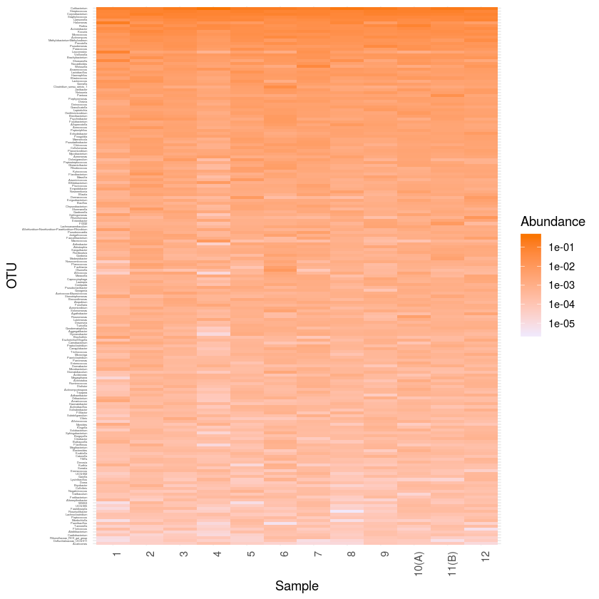


```R
plot_heatmap(mergeph1, "NULL", sample.order=levels1, taxa.order=rev(t5)) + scale_y_discrete(labels=ylabvec)  + theme_minimal () +
   scale_fill_gradient(low="#F1E8FA", high="#FA7500", na.value = "white", trans = "log10")  +
   theme(axis.text.x = element_text( angle = 90, hjust = 1),
         axis.text.y = element_text(size = 2.5))
                                   
 ggsave ("heatmap_core.pdf", width=20, height=80, units="cm")     
```

    Scale for 'fill' is already present. Adding another scale for 'fill', which
    will replace the existing scale.


```R
library(DESeq2)
library(RColorBrewer)
library(ggplot2)
library(phyloseq)
library(plyr)

metro_sig=subset_samples(metro, sample_type !="NA" )
metro_sig
obj1deseq = phyloseq_to_deseq2(metro_sig, ~sample_type)


gm_mean = function(x, na.rm=TRUE){
  exp(sum(log(x[x > 0]), na.rm=na.rm) / length(x))
}

geoMeans = apply(counts(obj1deseq), 1, gm_mean)
obj1deseq = estimateSizeFactors(obj1deseq, geoMeans = geoMeans)

##adición de la viñeta para el error de la media de 0s
obj1deseq = DESeq(obj1deseq, fitType="local")

#obj1deseq = DESeq(obj1deseq, test="Wald", fitType="parametric")
```

    Loading required package: S4Vectors
    Loading required package: stats4
    Loading required package: BiocGenerics
    
    Attaching package: ‘BiocGenerics’
    
    The following objects are masked from ‘package:parallel’:
    
        clusterApply, clusterApplyLB, clusterCall, clusterEvalQ,
        clusterExport, clusterMap, parApply, parCapply, parLapply,
        parLapplyLB, parRapply, parSapply, parSapplyLB
    
    The following objects are masked from ‘package:dplyr’:
    
        combine, intersect, setdiff, union
    
    The following objects are masked from ‘package:stats’:
    
        IQR, mad, sd, var, xtabs
    
    The following objects are masked from ‘package:base’:
    
        anyDuplicated, append, as.data.frame, basename, cbind, colMeans,
        colnames, colSums, dirname, do.call, duplicated, eval, evalq,
        Filter, Find, get, grep, grepl, intersect, is.unsorted, lapply,
        lengths, Map, mapply, match, mget, order, paste, pmax, pmax.int,
        pmin, pmin.int, Position, rank, rbind, Reduce, rowMeans, rownames,
        rowSums, sapply, setdiff, sort, table, tapply, union, unique,
        unsplit, which, which.max, which.min
    
    
    Attaching package: ‘S4Vectors’
    
    The following objects are masked from ‘package:dplyr’:
    
        first, rename
    
    The following object is masked from ‘package:tidyr’:
    
        expand
    
    The following object is masked from ‘package:base’:
    
        expand.grid
    
    Loading required package: IRanges
    
    Attaching package: ‘IRanges’
    
    The following object is masked from ‘package:phyloseq’:
    
        distance
    
    The following objects are masked from ‘package:dplyr’:
    
        collapse, desc, slice
    
    The following object is masked from ‘package:purrr’:
    
        reduce
    
    Loading required package: GenomicRanges
    Loading required package: GenomeInfoDb
    Loading required package: SummarizedExperiment
    Loading required package: Biobase
    Welcome to Bioconductor
    
        Vignettes contain introductory material; view with
        'browseVignettes()'. To cite Bioconductor, see
        'citation("Biobase")', and for packages 'citation("pkgname")'.
    
    
    Attaching package: ‘Biobase’
    
    The following object is masked from ‘package:phyloseq’:
    
        sampleNames
    
    Loading required package: DelayedArray
    Loading required package: matrixStats
    
    Attaching package: ‘matrixStats’
    
    The following objects are masked from ‘package:Biobase’:
    
        anyMissing, rowMedians
    
    The following object is masked from ‘package:dplyr’:
    
        count
    
    Loading required package: BiocParallel
    
    Attaching package: ‘DelayedArray’
    
    The following objects are masked from ‘package:matrixStats’:
    
        colMaxs, colMins, colRanges, rowMaxs, rowMins, rowRanges
    
    The following object is masked from ‘package:purrr’:
    
        simplify
    
    The following objects are masked from ‘package:base’:
    
        aperm, apply
    
    ------------------------------------------------------------------------------
    You have loaded plyr after dplyr - this is likely to cause problems.
    If you need functions from both plyr and dplyr, please load plyr first, then dplyr:
    library(plyr); library(dplyr)
    ------------------------------------------------------------------------------
    
    Attaching package: ‘plyr’
    
    The following object is masked from ‘package:matrixStats’:
    
        count
    
    The following object is masked from ‘package:IRanges’:
    
        desc
    
    The following object is masked from ‘package:S4Vectors’:
    
        rename
    
    The following objects are masked from ‘package:dplyr’:
    
        arrange, count, desc, failwith, id, mutate, rename, summarise,
        summarize
    
    The following object is masked from ‘package:purrr’:
    
        compact
    


    phyloseq-class experiment-level object
    otu_table()   OTU Table:         [ 22673 taxa and 47 samples ]
    sample_data() Sample Data:       [ 47 samples by 29 sample variables ]
    tax_table()   Taxonomy Table:    [ 22673 taxa by 6 taxonomic ranks ]


    converting counts to integer mode
    using pre-existing size factors
    estimating dispersions
    gene-wise dispersion estimates
    mean-dispersion relationship
    final dispersion estimates
    fitting model and testing
    -- replacing outliers and refitting for 8421 genes
    -- DESeq argument 'minReplicatesForReplace' = 7 
    -- original counts are preserved in counts(dds)
    estimating dispersions
    fitting model and testing


```R
res = results(obj1deseq, cooksCutoff = FALSE)
# quick explanation of Cook's distance: it measures within each gene, for each sample, how removing that sample would change the LFCs (all of the coefficients implied by the design and estimated by DESeq2). So if you have e.g. 3 samples vs 2 samples, and the counts for a gene are [10,10,10] vs [15, 1000], you can see how the Cook's distance will be high for the two samples. Removing either one changes the LFC for the comparison of the two groups. However, if it were [10,10,10] vs [50,50], the two samples "support" each other, such that removing one doesn't change the LFC at all. Hence, we find Cook's to be useful for identifying outliers.
alpha = 0.01
sigtab = res[which(res$padj < alpha), ]
sigtab = cbind(as(sigtab, "data.frame"), as(tax_table(metro_sig)[rownames(sigtab), ], "matrix"))
# Phylum order
x = tapply(sigtab$log2FoldChange, sigtab$Phylum, function(x) max(x))
x = sort(x, TRUE)
sigtab$Phylum = factor(as.character(sigtab$Phylum), levels=names(x))
# Genus order
x = tapply(sigtab$log2FoldChange, sigtab$Genus, function(x) max(x))
x = sort(x, TRUE)
sigtab$Genus = factor(as.character(sigtab$Genus), levels=names(x))

ggplot(sigtab, aes(x=Genus, y=log2FoldChange, color=Phylum)) + scale_color_manual(values=colorRampPalette(brewer.pal(8,"Dark2"))(20))+geom_point(size=3)+theme_light() +theme(axis.text.x = element_text(angle = -90, hjust = 0, vjust=0.5)) + coord_flip()
#sigtab
#ggsave ("torniquete_pasamanos_SIG.pdf", width=30, height=15, units="cm")
sigtab
           
 write.table(sigtab,"handrail-turnstileOR.csv",sep="\t")           
```


<table>
<thead><tr><th></th><th scope=col>baseMean</th><th scope=col>log2FoldChange</th><th scope=col>lfcSE</th><th scope=col>stat</th><th scope=col>pvalue</th><th scope=col>padj</th><th scope=col>Kingdom</th><th scope=col>Phylum</th><th scope=col>Class</th><th scope=col>Order</th><th scope=col>Family</th><th scope=col>Genus</th></tr></thead>
<tbody>
	<tr><th scope=row>ASV_1</th><td>16132.859322                  </td><td> -1.459546                    </td><td>0.3683595                     </td><td> -3.962286                    </td><td>7.423561e-05                  </td><td>6.475629e-03                  </td><td>Bacteria                      </td><td>Actinobacteriota              </td><td>Actinobacteria                </td><td>Propionibacteriales           </td><td>Propionibacteriaceae          </td><td>Cutibacterium                 </td></tr>
	<tr><th scope=row>ASV_4</th><td> 2146.727806                  </td><td> -1.246392                    </td><td>0.3191419                     </td><td> -3.905448                    </td><td>9.405103e-05                  </td><td>7.110258e-03                  </td><td>Bacteria                      </td><td>Actinobacteriota              </td><td>Actinobacteria                </td><td>Corynebacteriales             </td><td>Corynebacteriaceae            </td><td>Lawsonella                    </td></tr>
	<tr><th scope=row>ASV_20</th><td>  497.860423                  </td><td>  2.009594                    </td><td>0.4142819                     </td><td>  4.850790                    </td><td>1.229709e-06                  </td><td>1.267718e-04                  </td><td>Bacteria                      </td><td>Actinobacteriota              </td><td>Actinobacteria                </td><td>Micrococcales                 </td><td>Micrococcaceae                </td><td>Kocuria                       </td></tr>
	<tr><th scope=row>ASV_21</th><td>  469.021045                  </td><td>  1.278936                    </td><td>0.3325598                     </td><td>  3.845732                    </td><td>1.201930e-04                  </td><td>8.518676e-03                  </td><td>Bacteria                      </td><td>Actinobacteriota              </td><td>Actinobacteria                </td><td>Micrococcales                 </td><td>Micrococcaceae                </td><td>Kocuria                       </td></tr>
	<tr><th scope=row>ASV_35</th><td>  286.296527                  </td><td>  1.286759                    </td><td>0.3289152                     </td><td>  3.912130                    </td><td>9.148558e-05                  </td><td>7.110258e-03                  </td><td>Bacteria                      </td><td>Actinobacteriota              </td><td>Actinobacteria                </td><td>Frankiales                    </td><td>Geodermatophilaceae           </td><td>Blastococcus                  </td></tr>
	<tr><th scope=row>ASV_216</th><td>   12.696749                  </td><td>-24.642029                    </td><td>2.9166383                     </td><td> -8.448778                    </td><td>2.943678e-17                  </td><td>5.563552e-15                  </td><td>Bacteria                      </td><td>Actinobacteriota              </td><td>Actinobacteria                </td><td>Corynebacteriales             </td><td>Corynebacteriaceae            </td><td>Corynebacterium               </td></tr>
	<tr><th scope=row>ASV_405</th><td>   22.251272                  </td><td> 23.939615                    </td><td>2.0813607                     </td><td> 11.501906                    </td><td>1.290340e-30                  </td><td>1.463246e-27                  </td><td>Bacteria                      </td><td>Proteobacteria                </td><td>Alphaproteobacteria           </td><td>Rickettsiales                 </td><td>Mitochondria                  </td><td>NA                            </td></tr>
	<tr><th scope=row>ASV_436</th><td>    7.071797                  </td><td>-23.844134                    </td><td>2.9172184                     </td><td> -8.173586                    </td><td>2.993568e-16                  </td><td>4.849580e-14                  </td><td>Bacteria                      </td><td>Actinobacteriota              </td><td>Actinobacteria                </td><td>Propionibacteriales           </td><td>Propionibacteriaceae          </td><td>Cutibacterium                 </td></tr>
	<tr><th scope=row>ASV_516</th><td>   10.375836                  </td><td> 22.875134                    </td><td>2.9179937                     </td><td>  7.839336                    </td><td>4.529343e-15                  </td><td>6.420344e-13                  </td><td>Bacteria                      </td><td>Actinobacteriota              </td><td>Actinobacteria                </td><td>Corynebacteriales             </td><td>Corynebacteriaceae            </td><td>Corynebacterium               </td></tr>
	<tr><th scope=row>ASV_535</th><td>   16.617408                  </td><td> 21.782770                    </td><td>2.9176957                     </td><td>  7.465744                    </td><td>8.283011e-14                  </td><td>9.392935e-12                  </td><td>Bacteria                      </td><td>Actinobacteriota              </td><td>Actinobacteria                </td><td>Corynebacteriales             </td><td>Corynebacteriaceae            </td><td>Corynebacterium               </td></tr>
	<tr><th scope=row>ASV_625</th><td>    7.981757                  </td><td> 22.510169                    </td><td>2.4877131                     </td><td>  9.048539                    </td><td>1.448943e-19                  </td><td>3.286202e-17                  </td><td>Bacteria                      </td><td>Actinobacteriota              </td><td>Actinobacteria                </td><td>Corynebacteriales             </td><td>Mycobacteriaceae              </td><td>Mycobacterium                 </td></tr>
	<tr><th scope=row>ASV_665</th><td>   14.272812                  </td><td>  7.084544                    </td><td>1.6714053                     </td><td>  4.238675                    </td><td>2.248426e-05                  </td><td>2.124763e-03                  </td><td>Bacteria                      </td><td>Actinobacteriota              </td><td>Actinobacteria                </td><td>Micrococcales                 </td><td>Micrococcaceae                </td><td>Kocuria                       </td></tr>
	<tr><th scope=row>ASV_704</th><td>   16.283553                  </td><td>-24.957553                    </td><td>2.2214287                     </td><td>-11.234911                    </td><td>2.747721e-29                  </td><td>1.557958e-26                  </td><td>Bacteria                      </td><td>Firmicutes                    </td><td>Negativicutes                 </td><td>Veillonellales-Selenomonadales</td><td>Veillonellaceae               </td><td>Veillonella                   </td></tr>
	<tr><th scope=row>ASV_712</th><td>   13.255468                  </td><td>-24.653074                    </td><td>2.5092269                     </td><td> -9.824968                    </td><td>8.790189e-23                  </td><td>3.322691e-20                  </td><td>Bacteria                      </td><td>Proteobacteria                </td><td>Gammaproteobacteria           </td><td>Burkholderiales               </td><td>Neisseriaceae                 </td><td>NA                            </td></tr>
	<tr><th scope=row>ASV_714</th><td>    9.475545                  </td><td> 22.748061                    </td><td>2.5060227                     </td><td>  9.077356                    </td><td>1.112438e-19                  </td><td>3.153763e-17                  </td><td>Bacteria                      </td><td>Firmicutes                    </td><td>Bacilli                       </td><td>Lactobacillales               </td><td>Streptococcaceae              </td><td>Streptococcus                 </td></tr>
	<tr><th scope=row>ASV_898</th><td>    7.761658                  </td><td> 22.461984                    </td><td>2.9182616                     </td><td>  7.697042                    </td><td>1.392517e-14                  </td><td>1.754571e-12                  </td><td>Bacteria                      </td><td>Proteobacteria                </td><td>Gammaproteobacteria           </td><td>Xanthomonadales               </td><td>Xanthomonadaceae              </td><td>Stenotrophomonas              </td></tr>
</tbody>
</table>


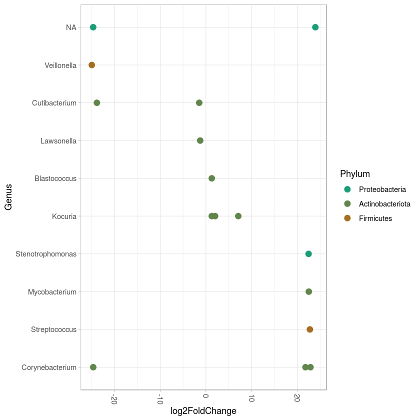


```R
metro
x4 <- tax_glom(metro, taxrank="Phylum")
metrotodos <- c("Pasamanos","Torniquete")
sample_data(x4)$todos = get_variable(x4, "sample_type") %in% metrotodos
mergeph1 <- merge_samples(x4, "todos")
mergeph1
x4 = transform_sample_counts(mergeph1,function(x) (x/sum(x))*100)
data <- psmelt(x4)           
                             head(data)
data$Phylum <- as.character(data$Phylum)

data$Phylum[data$Abundance <= 0.05] <- "Others < 0.05%"
z <- factor(unique(data$Phylum))
z <- nlevels(z)


library(tidyverse)
                                   
pd <- data %>% 
    as_tibble %>%
    mutate(Phylum = as.character(Phylum)) # %>%
#     replace_na(list(Phylum = "unknown"))
Phylum_abun <- pd %>%
    group_by(Phylum) %>%
    summarize(Abundance = sum(Abundance)) %>%
    arrange(Abundance)
Phylum_levels <- Phylum_abun$Phylum
pd0 <- pd %>%
    mutate(Phylum = factor(Phylum, Phylum_levels))
                            
p <- ggplot(pd0, aes(x = Sample, y = Abundance, fill= Phylum, color= Phylum)) + geom_bar(stat = "identity", position="stack")  +
                                   scale_fill_manual(values=(colorRampPalette(brewer.pal(10,"Paired"))(z))) +
                                   scale_color_manual(values=(colorRampPalette(brewer.pal(10,"Paired"))(z))) + theme_light() +
                                   theme(axis.text.x=element_text(angle=90, hjust=1)) #+ theme(legend.position="bottom") +  guides(fill=guide_legend(nrow=2))
                                   
p
 ggsave("phylum_allsamples_histogram.pdf")                            
```


    phyloseq-class experiment-level object
    otu_table()   OTU Table:         [ 22673 taxa and 47 samples ]
    sample_data() Sample Data:       [ 47 samples by 28 sample variables ]
    tax_table()   Taxonomy Table:    [ 22673 taxa by 6 taxonomic ranks ]


    phyloseq-class experiment-level object
    otu_table()   OTU Table:         [ 40 taxa and 1 samples ]
    sample_data() Sample Data:       [ 1 samples by 29 sample variables ]
    tax_table()   Taxonomy Table:    [ 40 taxa by 6 taxonomic ranks ]


<table>
<thead><tr><th></th><th scope=col>OTU</th><th scope=col>Sample</th><th scope=col>Abundance</th><th scope=col>id</th><th scope=col>sample_location</th><th scope=col>sample_id</th><th scope=col>line_number</th><th scope=col>sample_type</th><th scope=col>date</th><th scope=col>time</th><th scope=col>⋯</th><th scope=col>latitude</th><th scope=col>longitude</th><th scope=col>people_affluence</th><th scope=col>Observed</th><th scope=col>Chao1</th><th scope=col>Shannon</th><th scope=col>Simpson</th><th scope=col>todos</th><th scope=col>Kingdom</th><th scope=col>Phylum</th></tr></thead>
<tbody>
	<tr><th scope=row>1</th><td>ASV_1           </td><td>TRUE            </td><td>47.5006996      </td><td>24              </td><td>17.68085        </td><td>24              </td><td>6.297872        </td><td>1.510638        </td><td>3.404255        </td><td>19.85106        </td><td>⋯               </td><td>NA              </td><td>NA              </td><td>17859153        </td><td>9903.553        </td><td>15141.15        </td><td>6.380126        </td><td>0.9827077       </td><td>1               </td><td>Bacteria        </td><td>Actinobacteriota</td></tr>
	<tr><th scope=row>19</th><td>ASV_2           </td><td>TRUE            </td><td>25.3627386      </td><td>24              </td><td>17.68085        </td><td>24              </td><td>6.297872        </td><td>1.510638        </td><td>3.404255        </td><td>19.85106        </td><td>⋯               </td><td>NA              </td><td>NA              </td><td>17859153        </td><td>9903.553        </td><td>15141.15        </td><td>6.380126        </td><td>0.9827077       </td><td>1               </td><td>Bacteria        </td><td>Firmicutes      </td></tr>
	<tr><th scope=row>24</th><td>ASV_3           </td><td>TRUE            </td><td>17.2434928      </td><td>24              </td><td>17.68085        </td><td>24              </td><td>6.297872        </td><td>1.510638        </td><td>3.404255        </td><td>19.85106        </td><td>⋯               </td><td>NA              </td><td>NA              </td><td>17859153        </td><td>9903.553        </td><td>15141.15        </td><td>6.380126        </td><td>0.9827077       </td><td>1               </td><td>Bacteria        </td><td>Proteobacteria  </td></tr>
	<tr><th scope=row>33</th><td>ASV_7           </td><td>TRUE            </td><td> 4.0561480      </td><td>24              </td><td>17.68085        </td><td>24              </td><td>6.297872        </td><td>1.510638        </td><td>3.404255        </td><td>19.85106        </td><td>⋯               </td><td>NA              </td><td>NA              </td><td>17859153        </td><td>9903.553        </td><td>15141.15        </td><td>6.380126        </td><td>0.9827077       </td><td>1               </td><td>Bacteria        </td><td>Cyanobacteria   </td></tr>
	<tr><th scope=row>39</th><td>ASV_90          </td><td>TRUE            </td><td> 3.1905088      </td><td>24              </td><td>17.68085        </td><td>24              </td><td>6.297872        </td><td>1.510638        </td><td>3.404255        </td><td>19.85106        </td><td>⋯               </td><td>NA              </td><td>NA              </td><td>17859153        </td><td>9903.553        </td><td>15141.15        </td><td>6.380126        </td><td>0.9827077       </td><td>1               </td><td>Bacteria        </td><td>Bacteroidota    </td></tr>
	<tr><th scope=row>16</th><td>ASV_182         </td><td>TRUE            </td><td> 0.8116411      </td><td>24              </td><td>17.68085        </td><td>24              </td><td>6.297872        </td><td>1.510638        </td><td>3.404255        </td><td>19.85106        </td><td>⋯               </td><td>NA              </td><td>NA              </td><td>17859153        </td><td>9903.553        </td><td>15141.15        </td><td>6.380126        </td><td>0.9827077       </td><td>1               </td><td>Bacteria        </td><td>Chloroflexi     </td></tr>
</tbody>
</table>


    ── Attaching packages ─────────────────────────────────────── tidyverse 1.2.1 ──
    ✔ tibble  2.1.3       ✔ purrr   0.2.5  
    ✔ tidyr   0.8.2       ✔ dplyr   0.8.0.1
    ✔ readr   1.3.1       ✔ stringr 1.4.0  
    ✔ tibble  2.1.3       ✔ forcats 0.4.0  
    ── Conflicts ────────────────────────────────────────── tidyverse_conflicts() ──
    ✖ dplyr::filter() masks stats::filter()
    ✖ dplyr::lag()    masks stats::lag()
    Saving 6.67 x 6.67 in image


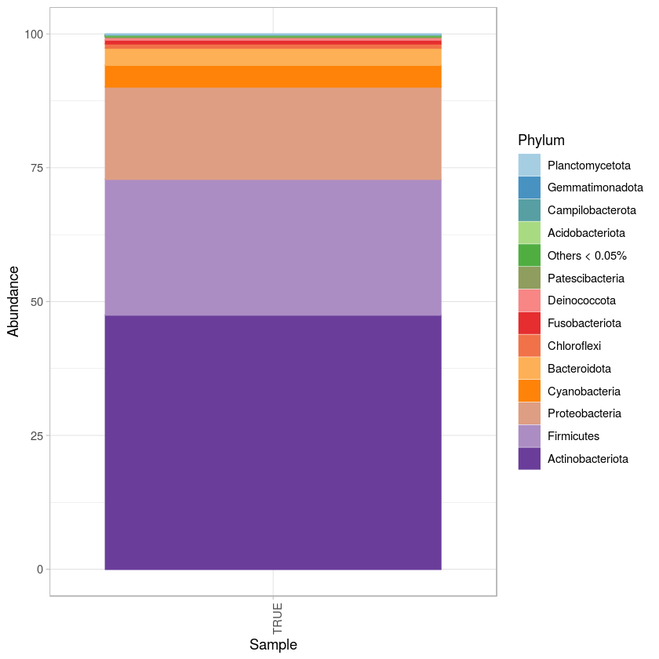


```R
metro
x4 <- tax_glom(metro, taxrank="Genus")
metrotodos <- c("Pasamanos","Torniquete")
sample_data(x4)$todos = get_variable(x4, "sample_type") %in% metrotodos
mergeph1 <- merge_samples(x4, "todos")
mergeph1
x4 = transform_sample_counts(mergeph1,function(x) (x/sum(x))*100)
data <- psmelt(x4)           
                             head(data)
data$Genus <- as.character(data$Genus)

data$Genus[data$Abundance <= 0.5] <- "Others < 0.5%"
z <- factor(unique(data$Genus))
z <- nlevels(z)
z

library(tidyverse)
                                   
pd <- data %>% 
    as_tibble %>%
    mutate(Genus = as.character(Genus)) # %>%
#     replace_na(list(Phylum = "unknown"))
Genus_abun <- pd %>%
    group_by(Genus) %>%
    summarize(Abundance = sum(Abundance)) %>%
    arrange(Abundance)
Genus_levels <- Genus_abun$Genus
pd0 <- pd %>%
    mutate(Genus = factor(Genus, Genus_levels))
                            
p <- ggplot(pd0, aes(x = Sample, y = Abundance, fill= Genus, color= Genus)) + geom_bar(stat = "identity", position="stack")  +
                                   scale_fill_manual(values=(colorRampPalette(brewer.pal(10,"Paired"))(z))) +
                                   scale_color_manual(values=(colorRampPalette(brewer.pal(10,"Paired"))(z))) + theme_light() +
                                   theme(axis.text.x=element_text(angle=90, hjust=1)) #+ theme(legend.position="bottom") +  guides(fill=guide_legend(nrow=2))
                                   
p
 ggsave("gemis_allsamples_histogram.pdf")                            
```


    phyloseq-class experiment-level object
    otu_table()   OTU Table:         [ 22673 taxa and 47 samples ]
    sample_data() Sample Data:       [ 47 samples by 28 sample variables ]
    tax_table()   Taxonomy Table:    [ 22673 taxa by 6 taxonomic ranks ]


    phyloseq-class experiment-level object
    otu_table()   OTU Table:         [ 1252 taxa and 1 samples ]
    sample_data() Sample Data:       [ 1 samples by 29 sample variables ]
    tax_table()   Taxonomy Table:    [ 1252 taxa by 6 taxonomic ranks ]


<table>
<thead><tr><th></th><th scope=col>OTU</th><th scope=col>Sample</th><th scope=col>Abundance</th><th scope=col>id</th><th scope=col>sample_location</th><th scope=col>sample_id</th><th scope=col>line_number</th><th scope=col>sample_type</th><th scope=col>date</th><th scope=col>time</th><th scope=col>⋯</th><th scope=col>Chao1</th><th scope=col>Shannon</th><th scope=col>Simpson</th><th scope=col>todos</th><th scope=col>Kingdom</th><th scope=col>Phylum</th><th scope=col>Class</th><th scope=col>Order</th><th scope=col>Family</th><th scope=col>Genus</th></tr></thead>
<tbody>
	<tr><th scope=row>1</th><td>ASV_1               </td><td>TRUE                </td><td>17.029251           </td><td>24                  </td><td>17.68085            </td><td>24                  </td><td>6.297872            </td><td>1.510638            </td><td>3.404255            </td><td>19.85106            </td><td>⋯                   </td><td>15141.15            </td><td>6.380126            </td><td>0.9827077           </td><td>1                   </td><td>Bacteria            </td><td>Actinobacteriota    </td><td>Actinobacteria      </td><td>Propionibacteriales </td><td>Propionibacteriaceae</td><td>Cutibacterium       </td></tr>
	<tr><th scope=row>496</th><td>ASV_2               </td><td>TRUE                </td><td> 8.912395           </td><td>24                  </td><td>17.68085            </td><td>24                  </td><td>6.297872            </td><td>1.510638            </td><td>3.404255            </td><td>19.85106            </td><td>⋯                   </td><td>15141.15            </td><td>6.380126            </td><td>0.9827077           </td><td>1                   </td><td>Bacteria            </td><td>Firmicutes          </td><td>Bacilli             </td><td>Lactobacillales     </td><td>Streptococcaceae    </td><td>Streptococcus       </td></tr>
	<tr><th scope=row>960</th><td>ASV_6               </td><td>TRUE                </td><td> 8.452160           </td><td>24                  </td><td>17.68085            </td><td>24                  </td><td>6.297872            </td><td>1.510638            </td><td>3.404255            </td><td>19.85106            </td><td>⋯                   </td><td>15141.15            </td><td>6.380126            </td><td>0.9827077           </td><td>1                   </td><td>Bacteria            </td><td>Actinobacteriota    </td><td>Actinobacteria      </td><td>Corynebacteriales   </td><td>Corynebacteriaceae  </td><td>Corynebacterium     </td></tr>
	<tr><th scope=row>869</th><td>ASV_5               </td><td>TRUE                </td><td> 5.407315           </td><td>24                  </td><td>17.68085            </td><td>24                  </td><td>6.297872            </td><td>1.510638            </td><td>3.404255            </td><td>19.85106            </td><td>⋯                   </td><td>15141.15            </td><td>6.380126            </td><td>0.9827077           </td><td>1                   </td><td>Bacteria            </td><td>Firmicutes          </td><td>Bacilli             </td><td>Staphylococcales    </td><td>Staphylococcaceae   </td><td>Staphylococcus      </td></tr>
	<tr><th scope=row>759</th><td>ASV_4               </td><td>TRUE                </td><td> 4.045221           </td><td>24                  </td><td>17.68085            </td><td>24                  </td><td>6.297872            </td><td>1.510638            </td><td>3.404255            </td><td>19.85106            </td><td>⋯                   </td><td>15141.15            </td><td>6.380126            </td><td>0.9827077           </td><td>1                   </td><td>Bacteria            </td><td>Actinobacteriota    </td><td>Actinobacteria      </td><td>Corynebacteriales   </td><td>Corynebacteriaceae  </td><td>Lawsonella          </td></tr>
	<tr><th scope=row>647</th><td>ASV_3               </td><td>TRUE                </td><td> 3.516355           </td><td>24                  </td><td>17.68085            </td><td>24                  </td><td>6.297872            </td><td>1.510638            </td><td>3.404255            </td><td>19.85106            </td><td>⋯                   </td><td>15141.15            </td><td>6.380126            </td><td>0.9827077           </td><td>1                   </td><td>Bacteria            </td><td>Proteobacteria      </td><td>Gammaproteobacteria </td><td>Oceanospirillales   </td><td>Halomonadaceae      </td><td>Halomonas           </td></tr>
</tbody>
</table>


29


    Saving 6.67 x 6.67 in image


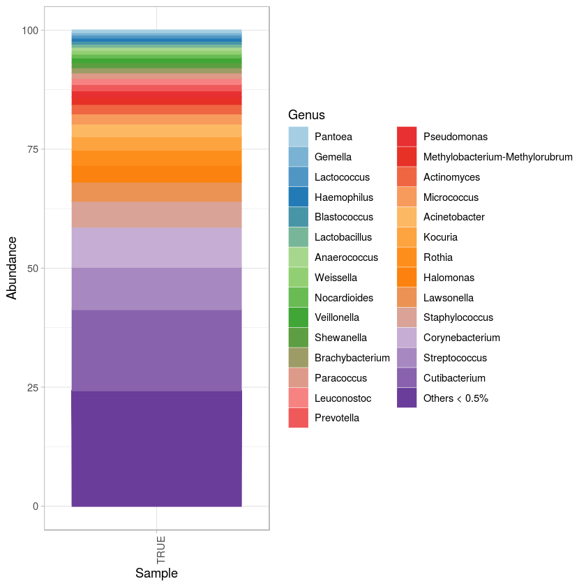


```R
x4
```


    phyloseq-class experiment-level object
    otu_table()   OTU Table:         [ 1252 taxa and 1 samples ]
    sample_data() Sample Data:       [ 1 samples by 29 sample variables ]
    tax_table()   Taxonomy Table:    [ 1252 taxa by 6 taxonomic ranks ]

